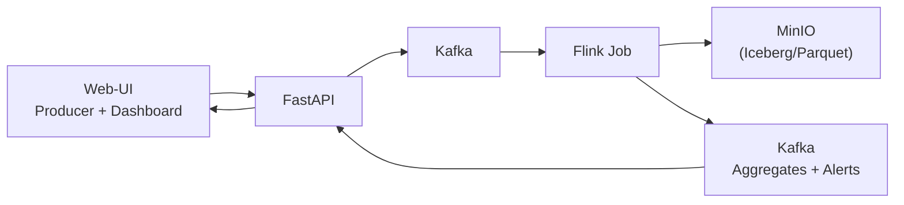

# IoT Sensor Monitoring auf Kubernetes

Streaming-Datenpipeline für IoT-Sensordaten mit Echtzeit-Verarbeitung, Alerting und Dashboard – lauffähig auf Kubernetes (k3s).

## Architektur



**Kappa-Architektur** – alle Daten fließen durch einen einzigen Streaming-Pfad.

## Komponenten

| Komponente | Technologie | Beschreibung |
|---|---|---|
| **Sensor Simulator** | Python | Erzeugt synthetische Sensordaten (Temperatur, Druck, Feuchtigkeit, Vibration) |
| **Web-UI** | HTML/JS + Tailwind + Chart.js | Producer-Ansicht und Echtzeit-Dashboard |
| **Backend API** | FastAPI (Python) | REST-API für Ingestion und Serving, WebSocket für Live-Updates |
| **Messaging** | Apache Kafka (KRaft) | Event-Streaming ohne Zookeeper |
| **Stream Processing** | Apache Flink (PyFlink) | Windowed Aggregation, Stateful Alerting, Enrichment |
| **Storage** | MinIO + Apache Iceberg | S3-kompatibler Lakehouse-Speicher |
| **Deployment** | Kubernetes (k3s) + Helm | Deklaratives Deployment aller Komponenten |

## Projektstruktur

```
Cloud-IoT/
├── sensor_simulator.py           # Sensor-Simulator (standalone)
├── docker-compose.yml            # Lokale Entwicklungsumgebung
├── backend/
│   ├── Dockerfile
│   ├── requirements.txt
│   └── app/
│       ├── __init__.py
│       └── main.py               # FastAPI mit Kafka-Integration
├── frontend/
│   ├── Dockerfile
│   ├── nginx.conf                # Reverse Proxy für API + WebSocket
│   └── public/
│       ├── index.html            # SPA mit Producer + Dashboard
│       ├── app.js                # Frontend-Logik
│       └── styles.css
├── flink-job/
│   ├── Dockerfile
│   ├── job.py                    # PyFlink Streaming Job
│   └── sensor_metadata.json      # Stammdaten für Enrichment
├── k8s/
│   └── helm/
│       └── iot-monitoring/
│           ├── Chart.yaml
│           ├── values.yaml
│           └── templates/        # K8s-Manifeste
└── assets/
    └── vorschlag-iot-sensormonitoring.md
```

## Schnellstart (Docker Compose)

```bash
# Alle Services starten
docker compose up -d --build

# Status prüfen
docker compose ps

# Logs verfolgen
docker compose logs -f backend
```

**Zugänge nach dem Start:**

| Service | URL |
|---|---|
| Web-UI (Frontend) | http://localhost:3000 |
| FastAPI Backend | http://localhost:8000/docs |
| Flink Web-UI | http://localhost:8081 |
| MinIO Console | http://localhost:9001 (minioadmin/minioadmin) |
| Kafka (extern) | localhost:9094 |

## Kubernetes Deployment (k3s)

### Voraussetzungen

- k3s Cluster (oder anderer K8s-Cluster)
- `kubectl` konfiguriert
- `helm` installiert
- Container-Images gebaut und verfügbar

### Images bauen

```bash
# Backend (Build-Context = Projektroot wegen sensor_simulator.py)
docker build -t iot-monitoring/backend:latest -f backend/Dockerfile .

# Frontend
docker build -t iot-monitoring/frontend:latest frontend/

# Flink Job
docker build -t iot-monitoring/flink-job:latest flink-job/
```

### Helm Chart installieren

```bash
# Namespace erstellen
kubectl create namespace iot-monitoring

# Helm Chart installieren
helm install iot-monitoring k8s/helm/iot-monitoring \
  --namespace iot-monitoring

# Status prüfen
kubectl get pods -n iot-monitoring

# Frontend erreichbar über NodePort
# http://<node-ip>:30080
```

### Skalierung demonstrieren

```bash
# Mehr TaskManager-Replikas
kubectl scale deployment flink-taskmanager --replicas=3 -n iot-monitoring

# Mehr Backend-Replikas
kubectl scale deployment backend --replicas=3 -n iot-monitoring

# Mehr Frontend-Replikas
kubectl scale deployment frontend --replicas=2 -n iot-monitoring
```

## Processing-Logik (Flink)

### 1. Tumbling-Window-Aggregation (1 Minute)

Pro Sensor werden über 1-Minuten-Fenster berechnet:
- Durchschnitt, Minimum, Maximum
- Anzahl der Messwerte

### 2. Stateful Alerting

Schwellwerte pro Sensortyp:

| Sensortyp | Schwelle (hoch) | Schwelle (niedrig) |
|---|---|---|
| Temperatur | 60.0 °C | -5.0 °C |
| Druck | 1050.0 hPa | 950.0 hPa |
| Feuchtigkeit | 85.0 % | 15.0 % |
| Vibration | 35.0 mm/s | 0.0 mm/s |

Alerts werden als `WARNING` oder `CRITICAL` (> 120% des Schwellwerts) klassifiziert.

### 3. Enrichment

Jedes Event wird mit statischen Stammdaten angereichert:
- Location Group (Production, Storage, Office, Infrastructure)
- Sensorbeschreibung

### 4. Late Data Handling

- Event Time Processing mit Watermarks
- Allowed Lateness: 10 Sekunden

## API-Endpunkte

| Methode | Pfad | Beschreibung |
|---|---|---|
| `GET` | `/api/health` | Health-Check |
| `POST` | `/api/events` | Einzelnes Event einspeisen |
| `POST` | `/api/events/batch` | Batch von Events einspeisen |
| `POST` | `/api/simulator/start` | Simulator starten |
| `POST` | `/api/simulator/stop` | Simulator stoppen |
| `GET` | `/api/simulator/status` | Simulator-Status |
| `GET` | `/api/events/recent` | Letzte Events |
| `GET` | `/api/alerts` | Aktuelle Alerts |
| `GET` | `/api/aggregates` | Aggregierte Werte |
| `WS` | `/ws/live` | WebSocket für Echtzeit-Updates |

## Sensor-Simulator (standalone)

```bash
# Ausgabe auf stdout
python sensor_simulator.py --num-sensors 50 --interval 0.5

# Direkt nach Kafka senden
python sensor_simulator.py --output kafka --kafka-bootstrap localhost:9094

# In Datei schreiben
python sensor_simulator.py --output file --file data.jsonl --max-events 1000
```

## Event-Schema

```json
{
  "sensor_id": "sensor-temp-0001",
  "timestamp": "2026-06-25T14:30:00.123456+00:00",
  "type": "temperature",
  "value": 42.5,
  "unit": "°C",
  "location": "Hall-A1"
}
```

## Lizenz

Siehe [LICENSE](LICENSE).