<p align="center">
  
</p>

<h1 align="center">SenseIQ</h1>

<p align="center">
  <em>Echtzeit-Überwachung verteilter Industriesensorik —<br/>
  eine Kappa-Streaming-Pipeline, deklarativ betrieben auf Kubernetes.</em>
</p>

---

## Inhalt

1. [Use Case und Motivation](#1-use-case-und-motivation)
2. [Datencharakteristik](#2-datencharakteristik)
3. [Architekturentscheidung](#3-architekturentscheidung)
4. [Komponenten und Datenfluss](#4-komponenten-und-datenfluss)
5. [Processing-Logik](#5-processing-logik)
6. [Speicherkonzept](#6-speicherkonzept)
7. [User-facing UI](#7-user-facing-ui)
8. [Kubernetes-Deployment](#8-kubernetes-deployment)
9. [Deployment-Anleitung](#9-deployment-anleitung)
10. [Wesentliche Codeabschnitte](#10-wesentliche-codeabschnitte)
11. [Screenshots und Nachweise](#11-screenshots-und-nachweise)
12. [Grenzen des Prototyps und Ausblick](#12-grenzen-des-prototyps-und-ausblick)

Ergänzend: [Eigenständigkeit und Innovation](#eigenständigkeit-und-innovation) ·
[Entwicklung](#entwicklung) ·
[Team und Eigenanteil](#team-und-eigenanteil) ·
[Repository-Struktur](#repository-struktur)

---

## Das System in einem Absatz

Ein Simulator speist einen kontinuierlichen Strom von Sensormesswerten nach
**Kafka**. **Flink** reichert ihn aus einem Sensorkatalog an, aggregiert ihn je
Sensor über Ein-Minuten-Fenster in **Event-Zeit** und erkennt anhaltende
Grenzwertverletzungen über **Keyed State**; Events, die ihr Fenster verpassen,
landen über einen Side Output in einem eigenen Kanal, statt verloren zu gehen.
Ein
**Archiver** schreibt Rohdaten, Aggregate, Alarme und Verspätete als vier
**Delta-Tabellen** in ein Lakehouse auf **SeaweedFS (S3)**, partitioniert nach
Ereigniszeit. Eine **FastAPI**-Serving-Schicht und eine **React**-Oberfläche
machen die Ergebnisse sichtbar. Alles läuft deklarativ als **Helm-Chart** auf
**k3s**, provisioniert per **Terraform** auf OpenStack. |

---

## 1. Use Case und Motivation

SenseIQ überwacht eine verteilte Industrieanlage. Die Sensoren melden
fortlaufend Messwerte aus drei Anlagenbereichen:

| Gruppe           | Überwachte Größen                                    |
| ---------------- | ---------------------------------------------------- |
| `Production`     | Temperatur, Druck und Vibration der Fertigungslinien |
| `Storage`        | Luftfeuchtigkeit im Kühllager                        |
| `Infrastructure` | Luftfeuchtigkeit im Serverraum                       |

**Wie groß die Flotte ist, steht nicht im Code.** Simulator und Flink-Job bauen
sie zur Laufzeit aus einem gemeinsamen Sensorkatalog auf
([`flink-job/metadata.json`](flink-job/metadata.json)), der zu jedem Sensor Typ,
Standort, Gruppe, Beschreibung und Grenzwerte führt. Sensoren kommen hinzu oder
fallen weg, indem dieser Katalog geändert wird — an Verarbeitungslogik, Schema
und Deployment ändert das nichts. Konkrete Stückzahlen nennt dieses Dokument
deshalb nur dort, wo ein Screenshot einen bestimmten Lauf zeigt.

**Das Problem.** Einzelne Messwerte sind wertlos. Interessant ist die
Entwicklung: Läuft ein Lager seit Minuten zu warm? Steigt die Vibration einer
Maschine dauerhaft, oder war das ein einzelner Ausschlag? Eine klassische
Datenbank mit periodischen Abfragen beantwortet das erst verzögert und
verdichtet nichts. SenseIQ beantwortet es im Strom: Es aggregiert je Sensor über
Ein-Minuten-Fenster, erkennt **anhaltende** Grenzwertverletzungen zustandsbehaftet
und legt sowohl Rohdaten als auch Ergebnisse für spätere Auswertungen ab.

**Die Datenquelle** ist ein Simulator
([`sensor_simulator.py`](sensor_simulator.py)), der ein Sensornetz nachbildet.
Er erzeugt die Werte nicht zufällig, sondern als _Random Walk mit
Mean Reversion_: Jeder Sensor hält einen eigenen Zustand, driftet gaußverteilt
weiter, wird um 1 % pro Messung zur Bereichsmitte zurückgezogen und erzeugt mit
1 % Wahrscheinlichkeit einen Ausschlag von ±5 Drift-Einheiten. Dadurch entstehen
zusammenhängende Zeitreihen mit gelegentlichen Spitzen — genau die Struktur, die
Fenster-Aggregation und zustandsbehaftetes Alerting überhaupt erst sinnvoll macht.

---

## 2. Datencharakteristik

| V            | Ausprägung in SenseIQ                                                                                                                                                                                                                                                                                                                                                                                                                                                            |
| ------------ | -------------------------------------------------------------------------------------------------------------------------------------------------------------------------------------------------------------------------------------------------------------------------------------------------------------------------------------------------------------------------------------------------------------------------------------------------------------------------------- |
| **Volume**   | Das Volumen ist ein **Konfigurationswert, keine Eigenschaft der Architektur**: Es ist das Produkt aus Katalogumfang und Sendeintervall (`simulator.interval`). Ein Sensor im Sekundentakt liefert **86 400 Events/Tag**, und jedes Event wird mehrfach abgelegt (roh, aggregiert, ausgewertet). Wo eine Anlage damit landet — Hunderttausende oder Hunderte Millionen Events pro Tag —, entscheidet der Katalog, nicht der Code.                                        |
| **Velocity** | Reines Streaming, kein Batch-Lauf. Ein Messwert erscheint spätestens nach Fensterlänge + Watermark-Verzögerung (60 s + 15 s) als Aggregat im Dashboard; Alerts entstehen ohne Fensterwartezeit direkt im Event-Strom.                                                                                                                                                                                                                                                            |
| **Variety**  | Sensortypen mit unterschiedlichen Einheiten (`°C`, `hPa`, `%`, `mm/s`), Wertebereichen und je eigenen Warn-/Kritisch-Schwellen, dazu Stammdaten (Gruppe, Standort, Beschreibung) aus dem Katalog.                                                                                                                                                                                                                                                                           |

**Warum das ein Big-Data-Problem ist.** Nicht die absolute Menge im Prototyp
macht es dazu, sondern die Kombination: ein **unbegrenzter, nie endender
Datenstrom**, dessen Wert in der zeitlichen Entwicklung liegt und nicht im
einzelnen Datensatz; eine Auswertung, die **zustandsbehaftet über die Zeit**
erfolgen muss und deshalb nicht als Abfrage auf einer Tabelle formulierbar ist;
und ein Aufbewahrungsbedarf, der linear mit Sensorzahl und Laufzeit wächst.
Eine relationale Datenbank mit periodischen Abfragen würde daran an drei Stellen
zugleich scheitern — Schreiblast, Aggregationsverzögerung und Historie.

**Auslegung auf Volumen.** Die Kette ist durchgängig so gebaut, dass steigende
Datenmengen durch Konfiguration aufgefangen werden, nicht durch Umbau:

- **Ingestion** — Kafka partitioniert den Strom (3 Partitionen), der Key
  `sensor_id` verteilt gleichmäßig und erhält zugleich die Reihenfolge je Sensor.
- **Verarbeitung** — die Flink-Parallelität ist über `flink.parallelism`
  einstellbar, zusätzliche TaskManager kommen über `flink.taskmanager.replicas`
  dazu.
- **Serving** — das Backend ist replica-fähig gebaut (siehe
  [Abschnitt 8](#8-kubernetes-deployment)) und lässt sich beliebig verbreitern.
- **Speicher** — das Archiv legt stündliche Partitionen an; wachsendes Volumen
  erzeugt mehr Objekte gleicher Größenordnung statt einzelner Riesendateien, und
  die Batchgröße (`APP_S3_ARCHIVE_MAX_BATCH`) steuert den Zuschnitt mit.

---

## 3. Architekturentscheidung

Gewählt wurde eine **Kappa-Architektur**: ein einziger Streaming-Pfad, keine
zweite Batch-Schicht.

**Begründung.**

- Alle fachlichen Anforderungen — Fensteraggregation, Alerting, Anreicherung —
  sind streaming-native. Es gibt keine Auswertung, die zwingend einen
  Batch-Durchlauf über den Gesamtbestand bräuchte.
- Historische Auswertungen werden aus dem Archiv derselben Streams bedient. Das
  Dataset `raw` enthält jedes Event unverändert, ist also **replay-fähig**: Um
  eine geänderte Verarbeitungslogik auf historische Daten anzuwenden, spielt man
  `raw` erneut in `sensor-events` ein — der klassische Kappa-Reprocessing-Weg.
  Die Voraussetzung dafür, die vollständige und unveränderte Rohdatenhistorie,
  legt die Pipeline im laufenden Betrieb selbst an.
- Eine Lambda-Architektur brächte einen zweiten Codepfad mit derselben
  Fachlogik in einer anderen Engine — doppelter Implementierungs- und
  Testaufwand, plus das Problem, Batch- und Speed-Layer konsistent zu halten.
  Für den Nutzen, den das hier hätte, ist das nicht zu rechtfertigen.

### Architekturdiagramm

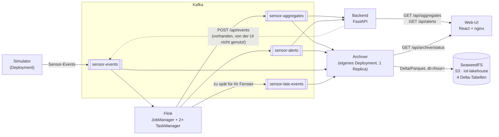
```mermaid
flowchart LR
  SIM["Simulator<br/>(Deployment)"]
  UI["Web-UI<br/>React + nginx"]
  BE["Backend<br/>FastAPI"]
  FL["Flink<br/>JobManager + 2× TaskManager"]
  AR["Archiver<br/>(eigenes Deployment, 1 Replica)"]
  S3[("SeaweedFS<br/>S3 · iot-lakehouse<br/>4 Delta-Tabellen")]

  KE[["sensor-events"]]
  KA[["sensor-aggregates"]]
  KL[["sensor-alerts"]]
  KT[["sensor-late-events"]]

  SIM -- "Sensor-Events" --> KE
  BE -. "POST /api/events<br/>(vorhanden, von der UI nicht genutzt)" .-> KE
  KE --> FL
  FL --> KA
  FL --> KL
  FL -- "zu spät für ihr Fenster" --> KT

  KA --> BE
  KL --> BE
  KA --> AR
  KL --> AR
  KE --> AR
  KT --> AR
  AR -- "Delta/Parquet, dt=/hour=" --> S3

  BE -- "GET /api/aggregates<br/>GET /api/alerts" --> UI
  AR -- "GET /api/archive/status" --> UI

  subgraph Kafka
    KE
    KA
    KL
    KT
  end
```

Drei Details, die das Diagramm bewusst zeigt und die von naheliegenden
Erwartungen abweichen:

- **Flink schreibt nicht selbst in den Objektspeicher.** Die Persistenz
  übernimmt ein eigener Archiver-Dienst, der alle vier Topics konsumiert.
  Begründung in [Abschnitt 4](#4-komponenten-und-datenfluss).
- **Der Archiver läuft mit genau einer Replica, das Backend mit zweien.** Eine
  Delta-Tabelle verträgt genau einen Schreiber; die Serving-Schicht bleibt
  davon unberührt und skaliert weiter. Begründung in
  [Abschnitt 6](#6-speicherkonzept).
- **Die Einspeisung liegt beim Simulator, nicht bei der UI.** Der Endpunkt
  `POST /api/events` steht als manueller Einspeiseweg bereit und mündet in
  dasselbe Topic; die Oberfläche selbst ist konsequent auf die Auswertung
  ausgerichtet (siehe [Abschnitt 7](#7-user-facing-ui)). Die Kante ist deshalb
  gestrichelt.

---

## 4. Komponenten und Datenfluss

| Komponente              | Technologie                                                  | Aufgabe                                                          | Warum diese Wahl                                                                                                                                      |
| ----------------------- | ------------------------------------------------------------ | ---------------------------------------------------------------- | ----------------------------------------------------------------------------------------------------------------------------------------------------- |
| Simulator               | Python 3.11                                                  | Erzeugt den Sensor-Datenstrom und schreibt ihn direkt nach Kafka | Eigenes Deployment statt UI-gesteuert: läuft unabhängig vom Browser, ist separat neustart- und skalierbar                                             |
| Message Broker          | Apache Kafka 7.6.1 + Zookeeper                               | Puffert und partitioniert den Event-Strom                        | Entkoppelt Ingestion, Verarbeitung, Serving und Archivierung; jede Seite skaliert für sich                                                            |
| Stream Processing       | Apache Flink 1.18 (PyFlink, DataStream API)                  | Anreicherung, Fenster-Aggregation, zustandsbehaftetes Alerting   | Echte Event-Time-Semantik mit Watermarks, Allowed Lateness und Keyed State — genau die Bausteine, die der Use Case braucht                            |
| Storage                 | SeaweedFS 3.80 (S3-API) + Delta Lake 1.6 (`deltalake`)       | Lakehouse für Roh- und Ergebnisdaten                             | S3-kompatibel, aber als Single-Binary deutlich ressourcenärmer als HDFS oder MinIO-Cluster; Delta ergänzt das Tabellenformat ohne zusätzlichen Dienst |
| Serving + Ingestion-API | FastAPI (Python 3.11)                                        | REST-Endpunkte fürs Dashboard, manuelle Einspeisung              | Eine Komponente statt zweier Services; Validierung über Pydantic                                                                                      |
| Archivierung            | FastAPI-Image, `APP_ARCHIVER_ENABLED=true`                   | Schreibt alle vier Topics in die Delta-Tabellen                  | Dasselbe Image wie das Backend, aber ein eigenes Deployment mit einer Replica — der Schreibpfad einer Delta-Tabelle duldet keinen zweiten Schreiber   |
| User-facing UI          | React 18 + Vite 5 + MUI 5 + Recharts, ausgeliefert von nginx | Visualisierung von Aggregaten, Alerts und Archivzustand          | SPA mit nginx-Reverse-Proxy auf das Backend — keine CORS-Sonderfälle, ein einziger exponierter Port                                                   |
| Orchestrierung          | Kubernetes (k3s) + Helm 3                                    | Deklarativer Betrieb aller Komponenten                           | Erfüllt die Betriebsanforderung; k3s ist auf kleinen VMs realistisch betreibbar                                                                       |
| Infrastruktur           | Terraform + OpenStack                                        | Provisioniert 3 Ubuntu-24.04-VMs und bootstrappt k3s             | Ein `terraform apply` erzeugt reproduzierbar den gesamten Cluster                                                                                     |

### Ende-zu-Ende-Datenfluss

1. Der **Simulator** liest den Katalog `/app/metadata.json`, baut daraus seine
   Sensor-Flotte und schreibt im konfigurierten Intervall Messwerte nach
   `sensor-events` — als JSON, mit `sensor_id` als Kafka-Key, damit alle Events
   eines Sensors in derselben Partition landen und ihre Reihenfolge behalten.
2. **Flink** liest `sensor-events`, vergibt Event-Time-Watermarks und reichert
   jedes Event aus dem Katalog um `group` und `description` an.
3. Der angereicherte Strom verzweigt sich:
   **(a)** `key_by(sensor_id)` → Ein-Minuten-Tumbling-Window → `avg`/`min`/`max`/`count`
   → `sensor-aggregates`.
   **(b)** `key_by(sensor_id)` → zustandsbehaftete Alarmlogik → `sensor-alerts`.
   Events, die selbst nach 30 s Allowed Lateness zu spät kommen, gehen über einen
   Side Output nach `sensor-late-events`.
4. Zwei Consumer lesen diese Topics zu unterschiedlichen Zwecken:
   - Der **Serving-Consumer** im Backend hält die letzten Aggregate und Alerts
     im Arbeitsspeicher und beantwortet damit die REST-Endpunkte.
   - Der **Archiver** — ein eigenes Deployment auf demselben Image — puffert
     Records aller vier Topics und committet sie in die zugehörige
     Delta-Tabelle.
5. Die **Web-UI** fragt alle 5 Sekunden `/api/aggregates`, `/api/alerts` und
   `/api/archive/status` ab und rendert Kennzahlen, Alarme, Zeitreihen und den
   Zustand des Lakehouse. Die ersten beiden Endpunkte beantwortet das Backend,
   den dritten der Archiver; nginx unterscheidet sie am Pfad-Präfix
   ([`frontend/nginx.conf`](frontend/nginx.conf)).

### Begründete Abweichungen

- **SeaweedFS statt HDFS oder MinIO.** SeaweedFS läuft als _ein_ Prozess
  (Master, Volume-Server, Filer und S3-Gateway in einem Pod) und belegt
  256 Mi Speicher. Ein HDFS-Setup (NameNode + DataNodes) oder ein
  MinIO-Verbund wäre auf drei kleinen VMs, die sich Kafka, Flink und die
  Anwendung teilen, unverhältnismäßig: Die Ressourcen, die der Objektspeicher
  dort zusätzlich belegt, fehlen unmittelbar der Verarbeitung — also genau der
  Schicht, um die es in diesem Projekt geht.

  **Entscheidend ist aber, dass die Wahl nichts festlegt.** Die Anwendung
  spricht ausschließlich die S3-API: Die Tabellen schreibt delta-rs über seinen
  S3-Store, die Quarantäne-Objekte `boto3`. Kein Codepfad, kein Schema und kein
  Dateiformat kennt SeaweedFS. Der Umzug auf MinIO, Ceph RGW oder AWS S3 ist
  deshalb eine Konfigurationsänderung an drei Werten — `APP_S3_ENDPOINT` und
  `APP_S3_BUCKET` in der ConfigMap `backend-config`, die Zugangsdaten im Secret
  `seaweedfs-credentials` — plus dem Wegfall des SeaweedFS-StatefulSets aus dem
  Chart. Die Delta-Tabellen selbst ziehen unverändert mit: Parquet-Dateien und
  `_delta_log` sind ein reines Bucket-Layout und nach einem `aws s3 sync` ohne
  Konvertierung weiterlesbar.

  SeaweedFS ist hier also die **beste Wahl für einen Prototyp auf dieser
  Hardware**, nicht die bequemste Wahl überhaupt: Sie spart Ressourcen genau
  dort, wo im Prototyp keine sind, und legt den Produktivbetrieb auf nichts
  fest. Umgekehrt gilt dasselbe für den einen Punkt, an dem der konkrete
  Speicher heute doch durchschlägt — das nicht durchgesetzte bedingte `PUT`,
  das den Archiver auf eine Replica begrenzt ([Abschnitt
  8](#durchsatz-horizontal-skalierbar)). Diese Einschränkung entfiele mit
  MinIO oder AWS S3, ohne dass dafür etwas umgebaut werden müsste; sie ist eine
  Eigenschaft des gewählten Speichers, nicht der Architektur.
- **Archivierung als eigener Dienst statt als Flink-Sink.** Der PyFlink-Job
  bliebe sonst auf zusätzliche S3-Connector-JARs und deren Versionsabgleich mit
  Flink 1.18 angewiesen. Stattdessen sind die Kafka-Topics die _einzige_
  Integrationsgrenze zwischen Verarbeitung und Persistenz: Der Job kennt nur
  Kafka, der Archiver kennt nur Kafka und S3. Das erlaubt es außerdem, die
  Rohdaten mitzuschreiben, ohne den Verarbeitungsgraphen anzufassen. Dass der
  Archiver ein eigenes Deployment ist und nicht mehr ein Thread im Backend,
  folgt aus dem Tabellenformat und ist in
  [Abschnitt 6](#6-speicherkonzept) begründet.
- **Kein Strimzi / kein Kafka-Operator.** Ein einzelner Broker deckt den
  Bedarf; ein Operator wäre zusätzliche Dauerlast ohne Gegenwert.
- **Keine separate Query-Engine (Trino o. ä.).** Das Dashboard braucht die
  jeweils aktuellen Ergebnisse, und die liefert der Stream direkt und ohne
  Abfrageumweg. Eine Query-Engine zahlt sich erst bei Auswertungen über längere
  Zeiträume aus — dafür ist mit den Delta-Tabellen die Grundlage gelegt: Sie
  sind ohne Konvertierungsschritt von Spark, Trino, DuckDB oder pandas lesbar
  (siehe [Abschnitt 12](#12-grenzen-des-prototyps-und-ausblick)).

---

## 5. Processing-Logik

Der gesamte Verarbeitungsgraph liegt in [`flink-job/job.py`](flink-job/job.py)
(PyFlink 1.18, **DataStream API**, keine Table/SQL-API).

### 5.1 Anreicherung

[`enrich_event`](flink-job/job.py#L177-L191) schlägt jedes Event im Katalog nach
und ergänzt `group` und `description`. Der Katalog wird beim Laden des Moduls
einmal je TaskManager in den Speicher gelesen — bei 8 Einträgen ist ein
Broadcast-State überdimensioniert. Unbekannte Sensor-IDs erhalten
`group = "Unknown"`.

Die angereicherten Felder werden **in beide Ausgabeschemata durchgereicht** und
sind bis in die UI sichtbar: Die Gruppenauswahl der Sensoransicht wird aus dem
`group`-Feld der Aggregate gebildet, nicht aus einer Tabelle im Frontend.

### 5.2 Event Time und Watermarks

```python
WatermarkStrategy.for_bounded_out_of_orderness(Duration.of_seconds(15))
    .with_timestamp_assigner(EventTimestampAssigner())
    .with_idleness(Duration.of_seconds(SOURCE_IDLE_TIMEOUT_S))
```

[`job.py#L294-L298`](flink-job/job.py#L294-L298)

Die Zeitachse ist die **Event-Zeit** aus dem Feld `event_time`, nicht die
Ankunftszeit. [`EventTimestampAssigner`](flink-job/job.py#L88-L100) parst den
ISO-8601-Zeitstempel; schlägt das fehl, fällt er auf den Kafka-Record-Timestamp
zurück, statt das Event zu verwerfen.

`with_idleness` ist kein Detail: Die Watermark stromabwärts ist stets das
_Minimum_ über alle Source-Subtasks. Sobald die Parallelität die Partitionszahl
übersteigt, bekommt mindestens ein Subtask keine Partition zugewiesen, sendet nie
eine Watermark — und ohne Idleness-Timeout würden die Fenster **nie** feuern.

### 5.3 Fenster-Aggregation

```python
keyed_stream.window(TumblingEventTimeWindows.of(Time.minutes(1)))
    .allowed_lateness(ALLOWED_LATENESS_MS)
    .side_output_late_data(LATE_EVENTS_TAG)
    .process(WindowAggregateFunction(), ...)
```

[`job.py#L315-L318`](flink-job/job.py#L315-L318)

Je Sensor und Minute entstehen `avg_value`, `min_value`, `max_value` und
`event_count`. Ausgabeschema
([`job.py#L222-L241`](flink-job/job.py#L222-L241)):

| Feld                                   | Typ                        | Anmerkung                                                              |
| -------------------------------------- | -------------------------- | ---------------------------------------------------------------------- |
| `window_start`, `window_end`           | String `HH:MM`             | kurzes Label für Achsen und Tabellen                                   |
| `window_start_ts`, `window_end_ts`     | ISO-8601 UTC               | vollständiger Zeitstempel — Grundlage der Partitionierung im Lakehouse |
| `sensor_id`, `sensor_type`, `location` | String                     |                                                                        |
| `group`, `description`                 | String                     | aus der Anreicherung                                                   |
| `avg_value`, `min_value`, `max_value`  | Float (2 Nachkommastellen) |                                                                        |
| `event_count`                          | Integer                    | Anzahl Messwerte im Fenster                                            |

Beide Zeitdarstellungen existieren bewusst: Das kurze Label ist für die Anzeige,
der volle Zeitstempel für die Sortierung und die Partitionierung. Nur mit
`HH:MM` zu sortieren würde Fenster verschiedener Tage vermischen.

### 5.4 Zustandsbehaftetes Alerting

[`AlertingFunction`](flink-job/job.py#L102-L175) ist eine `KeyedProcessFunction`
mit zwei `ValueState`-Feldern je Sensor:

- `breach_count` — Anzahl aufeinanderfolgender Überschreitungen
- `last_alert_time` — Zeitpunkt des letzten ausgelösten Alarms

Die Logik:

1. `value >= warning_threshold` erhöht `breach_count`, ein Wert darunter setzt
   ihn auf 0 zurück.
2. Ein Alarm entsteht erst ab **drei aufeinanderfolgenden** Überschreitungen.
   Ein einzelner Ausreißer — und der Simulator erzeugt solche gezielt —
   löst also nichts aus.
3. Nach einem Alarm gilt eine **Unterdrückung von 30 Sekunden**, damit eine
   anhaltende Störung nicht sekündlich Alarme produziert.
4. Die Schwellen kommen sensorspezifisch aus dem Katalog, mit Rückfall auf
   `default_thresholds` je Sensortyp. `severity` ist `critical` ab dem
   kritischen Grenzwert, sonst `warning`.

| Sensortyp        | Warnung  | Kritisch |
| ---------------- | -------- | -------- |
| Temperatur       | 60 °C    | 70 °C    |
| Druck            | 1050 hPa | 1080 hPa |
| Luftfeuchtigkeit | 80 %     | 90 %     |
| Vibration        | 30 mm/s  | 40 mm/s  |

Die sensorspezifische Übersteuerung ist kein theoretischer Fall: Der
Serverraum-Sensor `sensor-humi-0005` warnt schon bei 65 % statt 80 %, weil dort
andere Anforderungen gelten als im Kühllager. Der Katalog ist damit die einzige
Stelle, an der fachliche Grenzwerte gepflegt werden — der Code kennt keine
hartkodierten Schwellen.

Genau das macht die Verarbeitung nicht-trivial: Die Entscheidung hängt nicht vom
einzelnen Event ab, sondern vom über die Zeit mitgeführten Zustand des Sensors.

### 5.5 Umgang mit verspäteten Daten

Drei Stufen, statt eines pauschalen Verwerfens:

| Verspätung    | Behandlung                                                                                                        |
| ------------- | ----------------------------------------------------------------------------------------------------------------- |
| bis 15 s      | von der Watermark abgedeckt, normal im Fenster verarbeitet                                                        |
| 15 s bis 45 s | Fenster bleibt 30 s über die Watermark hinaus offen (`allowed_lateness`); das Aggregat wird **erneut** ausgegeben |
| darüber       | Side Output → Topic `sensor-late-events` → archiviert unter `late/`                                               |

Der dritte Fall ist der interessante: Zu späte Events werden **nicht** stillschweigend
verworfen, sondern in einen eigenen Kanal geleitet und persistiert. Damit bleibt
jedes eingespeiste Event nachweisbar: Es lässt sich exakt beziffern — und im
Archiv einzeln nachschlagen —, welche Events ihr Fenster nicht mehr erreicht
haben. Die Vollständigkeit der Verarbeitung ist so belegbar statt nur
angenommen.

Zu beachten: Wegen `allowed_lateness` kann ein Fenster mehrfach ausgegeben werden.
Nachgelagerte Konsumenten sehen für dasselbe `(sensor_id, window_start_ts)` also
unter Umständen mehrere Versionen; die spätere ist die vollständigere.

### 5.6 Fehlertoleranz

`env.enable_checkpointing(30 s)`
([`job.py#L273`](flink-job/job.py#L273)) sichert Keyed State und
Kafka-Offsets. Ohne Checkpoints würde beim Ausfall eines TaskManagers jeder
`breach_count` mitten in einer laufenden Überschreitung auf 0 zurückfallen und
die Source am _aktuellen_ Offset wieder aufsetzen — also Events überspringen.

Die Checkpoints liegen im Speicher des JobManagers — bewusst so gewählt, denn
ein dauerhaftes `state.checkpoints.dir` setzt Storage mit `ReadWriteMany`
voraus, das der `local-path`-Provisioner von k3s nicht anbietet. Damit ist
genau der Fehlerfall abgedeckt, der im Betrieb regelmäßig vorkommt: der Ausfall
eines TaskManagers. Für den selteneren Ausfall des JobManagers genügt ein
Checkpoint-Verzeichnis auf S3 — der Objektspeicher dafür läuft bereits im
Cluster.

---

## 6. Speicherkonzept

Persistiert wird vom Archiver ([`backend/app/archiver.py`](backend/app/archiver.py),
[`backend/app/delta_writer.py`](backend/app/delta_writer.py)) nach SeaweedFS über
dessen S3-Gateway, im Bucket `iot-lakehouse`. Das Tabellenformat ist **Delta
Lake**, geschrieben mit `deltalake` 1.6 (delta-rs) — einer Rust-Bibliothek ohne
JVM und ohne eigenen Dienst.

### Vom Data Lake zum Lakehouse — warum migriert wurde

Die erste lauffähige Fassung schrieb **JSON Lines** in ein S3-Präfix: ein
klassischer Data Lake, schema-on-read, ein Objekt je Partition und Flush. Das
funktionierte — und wurde bewusst durch ein Lakehouse ersetzt
(Commit `cd31e24`, `feat(storage): migrate the data lake to a Delta Lake
lakehouse`). Die Migration hatte vier Gründe, jeder davon aus einem konkreten
Defizit des JSONL-Layouts:

**1. Ein Flush war nicht atomar.** Ein Flush verteilt sich auf mehrere
Partitionen und schrieb deshalb mehrere unabhängige `PUT`s. Brach der Prozess
dazwischen ab — Pod-Eviction, OOM, Rollout — war der Batch _halb_ sichtbar:
einige Partitionen geschrieben, andere nicht, und kein Merkmal an den Daten,
das den Unterschied anzeigte. Delta macht aus demselben Flush **einen
Transaktions-Commit**: Er wird als Ganzes sichtbar oder gar nicht.

**2. Ein Leser sah keinen definierten Stand.** Wer den Lake abfragte, sah
„was das Bucket-Listing gerade hergibt“ — inklusive der Objekte eines laufenden
Schreibvorgangs. Mit dem Transaktionslog liest ein Konsument eine **Version**
der Tabelle. `GET /api/history` gibt diese Versionsnummer deshalb in der
Antwort mit zurück: Eine Auswertung ist reproduzierbar, weil sie sich auf einen
benannten Stand bezieht.

**3. Zeilenorientiertes JSON ist für die Auswertung das falsche Format.** Die
Daten sind hochgradig redundant (`sensor_type`, `location`, `group` und
`description` wiederholen sich in jedem Record) und werden fast immer
spaltenweise ausgewertet. Parquet bringt dafür Spaltenkompression, Projektion
und Min/Max-Statistiken je Row Group — Letztere filtern _innerhalb_ einer
Datei und damit feiner, als die Stunden-Partition es je könnte.

**4. Ohne Schema war die Datenqualität unbeobachtet.** Unter JSONL landete
jeder Record im Lake, auch mit falschem Typ oder fehlendem Feld — der Fehler
fiel erst dem Leser auf, unter Umständen Wochen später. Delta erzwingt das
Schema **beim Schreiben**. Ein Record, der nicht passt, wird nicht
stillschweigend übernommen, sondern isoliert und nachvollziehbar abgelegt
(siehe [Umgang mit abgewiesenen Records](#umgang-mit-abgewiesenen-records)).


Was die Migration **gekostet** hat, steht offen in diesem Abschnitt: den
Wechsel zu schema-on-write (siehe [Schema](#schema)) und die Beschränkung auf
genau einen Schreiber (siehe [Genau ein Schreiber](#genau-ein-schreiber)). Beides
sind bewusst eingegangene Tauschgeschäfte, keine übersehenen Nebenwirkungen.

|                | vorher — Data Lake (JSONL)      | jetzt — Lakehouse (Delta/Parquet)                                   |
| -------------- | ------------------------------- | ------------------------------------------------------------------- |
| Schreibeinheit | mehrere unabhängige `PUT`s      | ein atomarer Commit                                                 |
| Sichtbarkeit   | Bucket-Listing                  | benannte Tabellenversion                                            |
| Dateiformat    | zeilenorientiert, unkomprimiert | spaltenorientiert, komprimiert, mit Statistiken                     |
| Schema         | schema-on-read                  | schema-on-write, erzwungen                                          |
| Partitionen    | nur im Objektschlüssel          | echte Spalten im Transaktionslog                                    |
| Historie       | keine                           | Time Travel über Versionen                                          |
| Schreiber      | beliebig viele                  | genau einer (Begründung in [Abschnitt 8](#8-kubernetes-deployment)) |

### Vier Datasets, vier Delta-Tabellen

| Tabelle       | Inhalt                                  | Zweck                                                             |
| ------------- | --------------------------------------- | ----------------------------------------------------------------- |
| `raw/`        | jedes Event unverändert wie eingespeist | unveränderliche Landing Zone, Grundlage für Reprocessing          |
| `aggregates/` | Fensterergebnisse                       | historische Auswertung, überlebt den Neustart der Serving-Schicht |
| `alerts/`     | ausgelöste Alarme                       | Nachweis der Verarbeitung, Alarmhistorie                          |
| `late/`       | Events jenseits der Allowed Lateness    | macht Datenverlust auditierbar                                    |

Sowohl Ein- als auch Ausgabe der Pipeline liegen im Lakehouse. Ergebnisse
existieren damit nicht nur im flüchtigen Speicher der Serving-Schicht.

### Layout und Partitionierung

```
s3://iot-lakehouse/{raw|aggregates|alerts|late}/
    _delta_log/00000000000000000000.json   ← das Transaktionslog
    dt=YYYY-MM-DD/hour=HH/part-….parquet   ← die Daten
```

Hive-Style-Partitionen, wie Spark, DuckDB, Trino und Athena sie für
_Partition Pruning_ erwarten: Eine Abfrage über einen Tag liest nur die
betroffenen Präfixe statt der ganzen Tabelle.

**Partitioniert wird nach Event-Zeit, nicht nach Ankunftszeit** — und je Dataset
über das jeweils passende Feld
([`archiver.py#L34-L39`](backend/app/archiver.py#L34-L39)):

| Dataset       | Zeitfeld          |
| ------------- | ----------------- |
| `raw`, `late` | `event_time`      |
| `aggregates`  | `window_start_ts` |
| `alerts`      | `timestamp`       |

Das ist die zentrale Entscheidung des Speicherkonzepts: Ein verspätet
eintreffendes oder erneut eingespieltes Event landet in der Partition, in die es
**fachlich** gehört. Damit ist eine Partition vollständig, sobald ihre Watermark
passiert ist — bei Partitionierung nach Ankunftszeit wäre sie das nie sicher.

Anders als beim vorherigen JSONL-Layout stehen `dt` und `hour` nicht nur im
Objektschlüssel, sondern sind **echte Spalten**: Delta verlangt das, weil das
Transaktionslog die Partitionswerte je Datei mitführt. Der Archiver hängt sie
vor dem Schreiben an ([`archiver.py#L128-L190`](backend/app/archiver.py#L128-L190)).

### Format: Parquet mit Delta als Tabellenformat

Geschrieben wird pro Flush **ein Commit** je Dataset; ein Flush erfolgt bei
**500 Records oder nach 60 Sekunden**. Die Batchgröße ist der Kompromiss gegen
das Small-File-Problem: Jedes Event einzeln zu committen ergäbe unzählige
Kleinstdateien und ein ebenso großes Transaktionslog.

**Begründung.** Die Speicherschicht besteht aus zwei Entscheidungen, die man
getrennt betrachten sollte:

_Parquet als Dateiformat_ bringt gegenüber JSON Lines

- **Spaltenkompression** — die Datenspalten sind hochgradig redundant
  (`sensor_type`, `location`, `group` wiederholen sich pro Record),
- **Projektion** — eine Auswertung nur über `avg_value` liest die übrigen
  Spalten nicht,
- **Prädikat-Pushdown innerhalb der Datei** über die Min/Max-Statistiken je
  Row Group, also feiner als die Stunden-Partition.

_Delta als Tabellenformat_ bringt das, was ein reines Spaltenformat nicht kann:

- **Atomare Commits.** Ein Flush wird als Ganzes sichtbar oder gar nicht. Das
  JSONL-Layout schrieb je Partition ein eigenes Objekt; brach der Prozess
  dazwischen ab, war der Batch halb sichtbar.
- **Konsistente Leser.** Ein Leser sieht die Tabelle in einer Version, nicht
  „was das Bucket-Listing gerade hergibt“ — inklusive laufender Schreibvorgänge.
- **Schema-Enforcement** statt schema-on-read.
- **Time Travel** über die Versionshistorie, was Reprocessing-Läufe
  nachvollziehbar macht.

**Warum Delta und nicht Iceberg.** Iceberg braucht einen Katalog (REST oder
SQL) als eigenen Dienst mit eigenem Zustand — auf drei kleinen VMs, die sich
bereits Kafka, Flink und die Anwendung teilen, ein spürbarer Zusatzaufwand.
delta-rs hält das Transaktionslog im Bucket selbst; die Tabellen brauchen
keinen zusätzlichen Pod, kein zusätzliches PVC und keine JVM. Für einen
Prototyp dieser Größe ist das der angemessene Schnitt.

**Warum Zeitstempel Strings bleiben.** Die Zeitfelder werden als `string`
abgelegt, nicht als `timestamp`. Sie sind ISO-8601 in UTC und sortieren damit
lexikografisch wie chronologisch — die Min/Max-Statistiken von Parquet
funktionieren also weiterhin für Bereichsabfragen. Im Gegenzug kann kein
Record auf dem Schreibpfad an einem Parse-Fehler scheitern.

### Schema

Jede Tabelle hat ein explizites Schema
([`delta_writer.py#L42-L92`](backend/app/delta_writer.py#L42-L92)), abgeleitet
aus den Produzenten: `raw` aus dem Wire-Format des Simulators, `aggregates` und
`alerts` aus den Ausgaben des Flink-Jobs, `late` aus dem Side Output — dieser
führt `group` und `description` mit, weil er am _angereicherten_ Strom hängt.

Damit wechselt die Speicherschicht von **schema-on-read** zu
**schema-on-write**, und das ist ein echter Tausch, kein reiner Gewinn:

|                       | vorher (JSONL)              | jetzt (Delta)                        |
| --------------------- | --------------------------- | ------------------------------------ |
| Neues Feld im Event   | landet automatisch im Store | muss in `SCHEMAS` ergänzt werden     |
| Feld mit falschem Typ | wird geschrieben            | wird abgewiesen                      |
| Datei ansehen         | `aws s3 cp … -` genügt      | benötigt einen Parquet-fähigen Leser |

Die Pipeline hat während der Entwicklung mehrfach Felder gewonnen (`group`,
`description`, `window_start_ts`). Unter JSONL kostete das nichts; jetzt ist es
eine bewusste Änderung an einer Stelle. Zwei Vorkehrungen halten diesen Tausch
beherrschbar:

- Ein Feld, das kein Schema kennt, wird **nicht stillschweigend** verworfen,
  sondern einmal je Feld als Warnung protokolliert
  ([`delta_writer.py#L128-L147`](backend/app/delta_writer.py#L128-L147)).
- Additive Änderungen werden mit `schema_mode="merge"` geschrieben: Ein neu in
  `SCHEMAS` ergänztes Feld erweitert die bestehende Tabelle, statt den Schreibpfad
  zu brechen.

### Umgang mit abgewiesenen Records

Schema-Enforcement schafft ein Problem, das es unter JSONL nicht gab: Ein
einzelner unpassender Record ließe sonst seinen gesamten Batch scheitern — und
weil der Archiver Kafka-Offsets erst nach erfolgreichem Flush committet, käme
derselbe Batch bei jedem Versuch erneut. Das Ergebnis wäre eine Endlosschleife,
die die Archivierung vollständig anhält.

Der Archiver isoliert deshalb den Verursacher
([`delta_writer.py#L149-L181`](backend/app/delta_writer.py#L149-L181)): Der
Batch wird zunächst als Ganzes konvertiert und nur im Fehlerfall Record für
Record geprüft. Die gültigen Records werden regulär committet, die abgewiesenen
landen als JSONL unter `_rejected/{dataset}/dt=…/hour=…/`
([`archiver.py#L98-L125`](backend/app/archiver.py#L98-L125)).

Das ist dieselbe Haltung wie beim `late`-Dataset: Was die Pipeline nicht
annehmen kann, wird aufgeschrieben statt verworfen, damit der Verlust
auditierbar bleibt. JSONL ist dort genau das richtige Format — es sind die
Records, die kein Schema hatten.

### Lesepfad

Die Serving-Endpunkte `/api/aggregates` und `/api/alerts` antworten aus dem
Arbeitsspeicher der Serving-Schicht und kennen deshalb nur die jüngste
Vergangenheit. Für alles darüber hinaus gibt es
`GET /api/history` ([`delta_reader.py`](backend/app/delta_reader.py)):

```
GET /api/history?dataset=aggregates&dt=2026-09-07&sensor_id=sensor-temp-0000&limit=100
```

| Parameter   | Wirkung                                                                          |
| ----------- | -------------------------------------------------------------------------------- |
| `dataset`   | eine der vier Tabellen; alles andere wird mit `400` abgewiesen                   |
| `dt`        | **Partitionsfilter** — wird an Delta durchgereicht, nicht nachgelagert gefiltert |
| `sensor_id` | Filter auf der Spalte                                                            |
| `limit`     | Standard 100, gedeckelt auf 1000                                                 |

Die Antwort führt neben den Zeilen die **Delta-Version** mit, aus der gelesen
wurde — die Abfrage bezieht sich damit auf einen definierten Stand der Tabelle
und nicht auf „was gerade im Bucket liegt“.

`dt` ist der eigentliche Punkt: Der Filter greift auf der Partition, sodass eine
Abfrage über einen Tag nur dessen Parquet-Dateien liest. Genau dafür wurde nach
Event-Zeit partitioniert.

Beantwortet wird der Endpunkt vom **Archiver-Pod**, nicht von der
Serving-Schicht: Lesen einer Delta-Tabelle braucht pyarrow, das die
Serving-Replicas bewusst nicht laden. nginx unterscheidet die beiden Ziele am
Pfad-Präfix ([`frontend/nginx.conf`](frontend/nginx.conf)); nach außen bleibt es
eine einzige API.

### Genau ein Schreiber

Eine Delta-Tabelle verträgt hier genau einen Schreiber. Der Archiver läuft
deshalb als eigenes Deployment mit einer Replica und `strategy: Recreate`,
während die Serving-Schicht weiter repliziert wird. Die Messung, die zu dieser
Festlegung geführt hat, und die Begründung im Detail stehen in
[Abschnitt 8](#8-kubernetes-deployment).

### Konsistenz

Der Archiver committet Kafka-Offsets erst **nach** dem erfolgreichen
Delta-Commit ([`archiver.py#L277`](backend/app/archiver.py#L277)),
`enable_auto_commit` ist abgeschaltet. Damit gilt **At-least-once**: Ein
Absturz zwischen Commit und Offset-Commit führt zu doppelt archivierten
Records, nicht zu verlorenen. Bei Schreibfehlern bleiben die Records gepuffert
(gedeckelt auf 10 000).

Gegenüber dem JSONL-Layout verengt sich das Duplikat-Fenster: Ein Flush ist
jetzt **ein** atomarer Commit statt mehrerer unabhängiger `PUT`s, sodass ein
Absturz mitten im Schreiben keinen halb sichtbaren Batch mehr hinterlässt.
Duplikate bleiben aber möglich; Konsumenten sollten je
`(sensor_id, window_start_ts)` die jüngste Fassung verwenden.

---

## 7. User-facing UI

Die Weboberfläche ist eine React-SPA (Vite, MUI, Recharts), ausgeliefert von
nginx. Der Browser spricht ausschließlich mit dem Frontend-Origin — es gibt
keinen CORS-Sonderfall und nur einen nach außen exponierten Port. nginx verteilt
`/api/` per `proxy_pass` auf die beiden Ziele hinter der API
([`frontend/nginx.conf`](frontend/nginx.conf)):

| Pfad            | Ziel            | Warum dorthin                                                            |
| --------------- | --------------- | ------------------------------------------------------------------------ |
| `/api/archive/` | `archiver:8000` | die Archivzähler entstehen im Archiver-Pod                               |
| `/api/history`  | `archiver:8000` | das Lesen einer Delta-Tabelle braucht pyarrow, das nur dort geladen wird |
| `/api/` (Rest)  | `backend:8000`  | Serving aus dem Arbeitsspeicher der Backend-Replicas                     |

nginx wählt das längste passende Präfix, weshalb die beiden spezielleren
Regeln vor `/api/` greifen. Nach außen bleibt es **eine** API unter **einer**
Adresse.

### Rolle: Anzeige

Die Prüfungsleistung verlangt die UI „mindestens in der Rolle des
Datenlieferanten **und/oder** zur Anzeige der verarbeiteten Ergebnisse“.
SenseIQ setzt bewusst auf die **Anzeigerolle** und baut sie dafür vollständig
aus: Kennzahlen, Alarme mit ihrem Zustandsverlauf, Zeitreihen über drei
Dimensionen und der Zustand des Lakehouse — jede Stufe der Pipeline wird in der
Oberfläche sichtbar.

Diese Aufteilung ist eine Entwurfsentscheidung: Die Dateneinspeisung übernimmt
der Simulator als eigenständige Komponente, die unabhängig vom Browser läuft und
für sich skaliert und neu gestartet werden kann. Ein manueller Einspeiseweg
steht über `POST /api/events` bereit — validiert per Pydantic und mit
`sensor_id` als Kafka-Key, also über exakt denselben Pfad wie der Simulator
(siehe [Abschnitt 9](#9-deployment-anleitung) für ein Beispiel). Die
Oberfläche selbst ruft ihn nicht auf; sie ist konsequent auf die Auswertung
ausgerichtet.

### Reale Anbindung

Die UI ist an die laufende Pipeline angebunden und zeigt **ausschließlich Daten,
die die Pipeline erzeugt hat**. [`LiveDataContext.jsx`](frontend/src/LiveDataContext.jsx)
fragt alle 5 Sekunden drei Endpunkte ab und verteilt das Ergebnis an alle
Ansichten.

Es gibt **keine Ersatz- oder Demodaten**. Ist das Backend nicht erreichbar,
zeigt die Oberfläche das explizit an, statt etwas darzustellen:

| Zustand   | Anzeige                                                                                           |
| --------- | ------------------------------------------------------------------------------------------------- |
| `loading` | Chip „Verbinde …", Ansichten melden „Lade …"                                                      |
| `online`  | Chip „Live-Daten“ (grün) mit Zeitstempel der letzten Aktualisierung                               |
| `offline` | Chip „Backend nicht erreichbar“ (rot), Ansichten melden „Backend nicht erreichbar — keine Daten." |

Zwei bewusste Konsequenzen: Kennzahlen zeigen im Offline-Fall „—“ statt „0“
(eine 0 würde etwas behaupten, das nicht bekannt ist), und beim Verbindungsverlust
werden die gehaltenen Daten verworfen — veraltete Werte unter einem
Offline-Hinweis lesen sich sonst wie aktuelle.

### Ansichten

**Dashboard** ([`DashboardView.jsx`](frontend/src/components/DashboardView.jsx))

- Drei Kennzahlen: aktive Alarme (davon kritisch), meldende Sensoren, Events pro
  Minute im jüngsten Fenster — alle aus den geladenen Daten berechnet.
- Alarmliste mit Sensor, Standort, Zeit, Schweregrad, Wert gegen Schwellwert und
  der Zahl aufeinanderfolgender Überschreitungen. Damit wird der Zustand aus
  Abschnitt 5.4 in der Oberfläche sichtbar.
- Panel **Lakehouse**: Commits und Datensätze gesamt und je Tabelle
  (`Rohdaten`, `Aggregate`, `Alerts`, `Verspätet`) samt der jeweils aktuellen
  Delta-Version sowie der zuletzt geschriebenen Tabelle. Weil der Archiver ein
  eigenes Deployment mit einer Replica ist, gelten die Zähler für den gesamten
  Strom und nicht mehr nur für eine Replica.

**Sensoren** ([`SensorsView.jsx`](frontend/src/components/SensorsView.jsx))

- Umschaltbar nach Gruppe, Sensortyp oder einzelnem Sensor. Die Auswahllisten
  entstehen aus den geladenen Aggregaten — die Gruppen stammen aus der
  Anreicherung im Flink-Job.
- Zeitreihendiagramm: bei Einzelsensoren Ø/Min/Max, sonst eine Ø-Linie je Sensor.
- Tabelle der 15 jüngsten Aggregate.

### Bedienablauf für die Demo

1. Frontend unter `http://<node-ip>:30080` öffnen.
2. Der Chip oben rechts zeigt „Live-Daten“ — das Backend antwortet.
3. Der Simulator läuft im Cluster; nach spätestens ~75 s erscheinen die ersten
   Aggregate, die Kennzahlen füllen sich.
4. Zur Sensoransicht wechseln, Dimension „Gruppe“ wählen: die Werte je
   Anlagenbereich im Verlauf.
5. Überschreitet ein Sensor dreimal in Folge seinen Grenzwert, erscheint auf dem
   Dashboard ein Alarm mit Schweregrad und Anzahl der Überschreitungen.
6. Das Lakehouse-Panel rechts zeigt Commits und Datensätze steigen, je Tabelle
   mit ihrer aktuellen Delta-Version — die Ergebnisse werden parallel
   persistiert und überleben damit einen Neustart der Serving-Schicht.

---

## 8. Kubernetes-Deployment

Alle Komponenten sind containerisiert und deklarativ beschrieben — als
Helm-Chart ([`helm/`](helm/)) und als äquivalente Rohmanifeste
([`k8s/`](k8s/)).

### Workloads

| Objekt              | Kind        | Replicas | Persistenz | Konfiguration                                               |
| ------------------- | ----------- | -------- | ---------- | ----------------------------------------------------------- |
| `frontend`          | Deployment  | 2        | —          | —                                                           |
| `backend`           | Deployment  | 2        | —          | ConfigMap `backend-config` + Secret `seaweedfs-credentials` |
| `archiver`          | Deployment  | 1        | —          | wie `backend`, plus `APP_ARCHIVER_ENABLED=true`             |
| `simulator`         | Deployment  | 1        | —          | CLI-Argumente                                               |
| `flink-jobmanager`  | Deployment  | 1        | —          | ConfigMap `flink-env` + `flink-conf`                        |
| `flink-taskmanager` | Deployment  | 2        | —          | ConfigMap `flink-env` + `flink-conf`                        |
| `kafka`             | StatefulSet | 1        | PVC 5 Gi   | ConfigMap `kafka-config`                                    |
| `zookeeper`         | StatefulSet | 1        | PVC 1 Gi   | inline `env`                                                |
| `seaweedfs`         | StatefulSet | 1        | PVC 10 Gi  | Secret (env + `s3_config.json`)                             |
| `flink-job-submit`  | Job         | —        | —          | ConfigMap `flink-env`                                       |

Gesamt: 6 Deployments, 3 StatefulSets, 1 Job, 7 Services, 4 ConfigMaps,
1 Secret, 3 PVCs (16 Gi).

**Zuordnung der Workload-Typen.** Zustandslose Komponenten sind Deployments —
sie sind austauschbar und beliebig ersetzbar. Kafka, Zookeeper und SeaweedFS
sind StatefulSets mit `volumeClaimTemplates`: Sie brauchen stabile Identität und
je eigenes Volume, das einen Pod-Neustart überlebt.

Der `archiver` ist der einzige Deployment mit `strategy: Recreate` statt des
voreingestellten `RollingUpdate`: Er darf zu keinem Zeitpunkt doppelt laufen
(Begründung unter [Skalierung](#skalierung)). Er teilt sich Image und ConfigMap
mit dem `backend` und unterscheidet sich allein durch `APP_ARCHIVER_ENABLED`.

Die Job-Einreichung ist bewusst ein **Job**, kein manueller Schritt:
`flink-job-submit` wartet auf den JobManager, prüft über `flink list`, ob die
Pipeline bereits läuft, und reicht sie andernfalls ein. Dadurch bringt
`kubectl apply` bzw. `helm install` eine _verarbeitende_ Pipeline hoch statt
eines leeren Flink-Clusters.

### Konfiguration und Secrets

- **ConfigMaps**: `backend-config` (Kafka-Adresse, Topic-Namen, S3-Endpunkt und
  Bucket), `flink-env` (Topics, Allowed Lateness, Checkpoint-Intervall,
  Parallelität), `flink-conf` (als Datei nach `/opt/flink/conf/flink-conf.yaml`
  gemountet), `kafka-config`.
- **Secret** `seaweedfs-credentials` in Doppelrolle: als `envFrom` für die
  S3-Zugangsdaten von Backend und Archiver und als gemountete
  `s3_config.json` für SeaweedFS.
- **PVCs** über `volumeClaimTemplates`, ohne `storageClassName` — es greift die
  Default-StorageClass, auf k3s der `local-path`-Provisioner.

### Skalierung

**Leitgedanke.** Keine Komponente hält Zustand, der eine zweite Instanz
ausschließen würde. Der Datenpfad ist von der Ingestion bis zum Archiv
durchgängig partitioniert: Kafka verteilt über den Key `sensor_id`, Flink
verarbeitet partitionsweise, und beide Consumer im Backend sind so entworfen,
dass zusätzliche Replicas ihre Arbeit korrekt aufteilen oder korrekt
vervielfachen — je nachdem, was ihre Aufgabe verlangt. Skalierung ist deshalb
überall eine Frage der Replica-Zahl, nicht des Umbaus.

#### Durchsatz: horizontal skalierbar

| Komponente          | Mechanismus                                                                    | Stellschraube                                                                |
| ------------------- | ------------------------------------------------------------------------------ | ---------------------------------------------------------------------------- |
| `frontend`          | zustandslos hinter einem Service, beliebig vervielfachbar                      | `frontend.replicas`                                                          |
| `backend`           | jede Replica bedient alle Anfragen vollständig                                 | `backend.replicas`                                                           |
| `archiver`          | **bewusst nicht skalierbar** — eine Delta-Tabelle duldet genau einen Schreiber | fest auf 1, siehe unten                                                      |
| `flink-taskmanager` | zusätzliche Pods stellen zusätzliche Task Slots bereit                         | `flink.taskmanager.replicas` × `taskSlots`, wirksam über `flink.parallelism` |
| `kafka`             | mehr Partitionen erhöhen die parallel verarbeitbaren Ströme                    | `kafka.numPartitions`                                                        |

Die Partitionszahl ist dabei die gemeinsame Obergrenze: Sie bestimmt, wie viele
Consumer einer Gruppe gleichzeitig arbeiten können, und ist deshalb der erste
Wert, der bei wachsender Last mitwächst.

**Das Backend ist gezielt für Replikation gebaut.** Es betreibt zwei
Kafka-Consumer mit bewusst **gegensätzlichen** Gruppenstrategien, weil ihre
Aufgaben Gegensätzliches verlangen:

- Der **Serving-Consumer** erhält je Prozess eine **eigene** Consumer Group
  (`backend-serving-<uuid8>`,
  [`kafka_utils.py#L24`](backend/app/kafka_utils.py#L24)). Jede Replica sieht
  damit _alle_ Partitionen und kann jede Anfrage vollständig beantworten — egal,
  welchen Pod der Load Balancer trifft. Bei geteilter Gruppe bekäme jede Replica
  nur einen Ausschnitt, und das Dashboard zeigte je nach getroffenem Pod andere
  Werte.
- Der **Archiver** nutzt eine **gemeinsame** Gruppe (`backend-archiver`), damit
  Kafka jeden Record **genau einmal** zustellt. Er läuft allerdings in einem
  eigenen Deployment mit genau einer Replica, sodass diese Gruppe derzeit nur
  ein Mitglied hat.

Damit kann `backend.replicas` gefahrlos erhöht werden: Der Lesepfad skaliert,
der Schreibpfad ist bewusst unskaliert.

**Warum der Archiver nicht mitskaliert.** Das ist keine Nachlässigkeit, sondern
eine Anforderung des Tabellenformats. Delta serialisiert Schreiber über die
Versionsnummern seines Transaktionslogs: Wer Version _n_ schreiben will, muss
sie exklusiv belegen können. Auf S3 setzt delta-rs dafür ein bedingtes `PUT`
(`If-None-Match`) ein — und SeaweedFS 3.80 **quittiert diese Bedingung, ohne
sie durchzusetzen**. Zwei Schreiber belegen dann beide Version _n_, und der
zweite überschreibt den ersten.

Ein Messlauf mit vier gleichzeitigen Schreibern und 200 Datensätzen gegen
SeaweedFS 3.80 endete mit **105 Datensätzen in der Tabelle und keiner einzigen
Fehlermeldung**. Genau das ist der gefährliche Fall: Unter JSONL hätten zwei
Schreiber zwei verschieden benannte Objekte erzeugt und nichts verloren.

Daraus folgen zwei Festlegungen:

- Der Archiver ist ein **eigenes Deployment mit `replicas: 1`**
  ([`k8s/archiver.yaml`](k8s/archiver.yaml)); die Replica-Zahl ist bewusst
  **nicht** in `values.yaml` konfigurierbar, weil ein höherer Wert die Tabellen
  beschädigen würde.
- Es gilt **`strategy: Recreate`** statt des voreingestellten
  `RollingUpdate` — dieses ließe während eines Rollouts kurzzeitig alten und
  neuen Pod gleichzeitig laufen, also exakt den Zwei-Schreiber-Fall, den das
  Deployment verhindern soll.

Die Alternative — `AWS_S3_ALLOW_UNSAFE_RENAME`, die Notluke von delta-rs für
Speicher ohne bedingtes `PUT` — ist bewusst **nicht** gesetzt
([`delta_writer.py`](backend/app/delta_writer.py)): Sie würde den Konflikt
nicht lösen, sondern nur unsichtbar machen. Korrektheit ergibt sich hier aus
dem Deployment, nicht aus einer Eigenschaft des Objektspeichers.

#### Verfügbarkeit: eigene Dimension

`flink-jobmanager` und `zookeeper` laufen mit einer Replica. Das ist keine
Durchsatzgrenze: Beide sind **Koordinatoren**, keine Verarbeiter — der Durchsatz
von Flink skaliert über die TaskManager, nicht über den JobManager. Zusätzliche
Instanzen dienen bei ihnen der Ausfallsicherheit (Active/Standby-HA beim
JobManager, Quorum beim Zookeeper-Ensemble), nicht der Leistung. Für den
Prototyp ist die Ausfallsicherheit bewusst nicht ausgebaut; der Weg dorthin ist
Standardkonfiguration der jeweiligen Systeme.

#### Dimensionierung des Prototyps

`kafka`, `zookeeper` und `seaweedfs` sind hier mit einer Replica konfiguriert.
Das ist eine **Auslegungsentscheidung für drei kleine VMs**, die sich Broker,
Stream-Engine, Objektspeicher und Anwendung teilen — kein Merkmal der
Architektur. Alle drei sind verteilte Systeme, und der Weg zum Cluster ist bei
jedem der dokumentierte Standardweg:

| Komponente  | Ausbau zum Cluster                                                                                                                            |
| ----------- | --------------------------------------------------------------------------------------------------------------------------------------------- |
| `kafka`     | Broker-Identität je Pod aus dem StatefulSet-Ordinal statt aus der gemeinsamen ConfigMap, Replikationsfaktor > 1                               |
| `zookeeper` | Ensemble aus drei Knoten mit `myid` je Pod (alternativ KRaft, womit Zookeeper ganz entfällt)                                                  |
| `seaweedfs` | Aufteilung des All-in-One-Prozesses in Master-, Volume- und Filer-Rollen; Kapazität und Durchsatz wachsen dann über zusätzliche Volume-Server |

Weil die Anwendung ausschließlich über die Kafka- und S3-Schnittstellen mit
diesen Systemen spricht, betrifft dieser Ausbau **keinen Anwendungscode**.

#### Demonstration

```bash
# imperativ, im laufenden Betrieb
kubectl -n iot-monitoring scale deployment/backend --replicas=4
kubectl -n iot-monitoring get pods -l app=backend

# deklarativ über das Chart — der reproduzierbare Weg
helm upgrade iot-monitoring ./helm -n iot-monitoring \
  --set backend.replicas=4 \
  --set frontend.replicas=4 \
  --set flink.taskmanager.replicas=4 \
  --set flink.parallelism=3
```

Skaliert wird **deklarativ über `values.yaml`**: Die Replica-Zahlen sind Teil
derselben versionierten Konfiguration wie der Rest des Deployments, ein
Cluster-Zustand ist damit jederzeit reproduzierbar. Eine lastabhängige
Automatik (HPA auf Basis des Kafka-Consumer-Lag) ist der nächste Schritt und in
[Abschnitt 12](#12-grenzen-des-prototyps-und-ausblick) benannt.

---

## 9. Deployment-Anleitung

### Voraussetzungen

- 3 VMs mit Ubuntu 24.04, je 4 vCPU / 8 GB RAM / 50 GB Disk
- Docker (Build), `kubectl`, Helm 3
- Für den Terraform-Weg: OpenStack-Zugang über `clouds.yaml`, Terraform ≥ 1.3

### Weg A — Terraform (empfohlen, ein Befehl)

Provisioniert die VMs, installiert k3s, baut die Images auf **jedem** Knoten,
importiert sie in containerd, installiert Helm und rollt den Stack aus.

```bash
cd terraform
cp terraform.tfvars.example terraform.tfvars   # Keypair, Netz, Image-ID eintragen
terraform init
terraform apply
```

Fortschritt auf dem Server-Knoten: `/var/log/iot-bootstrap.log`, Abschluss-
markierung `/var/log/iot-bootstrap.done`. Die UI erreicht man anschließend unter
der ausgegebenen Adresse `web_ui`.

> **Netzwerk-Besonderheit.** Das k3s-Cluster läuft **single-stack IPv4**, weil
> Dual-Stack auf dieser OpenStack-Umgebung kube-proxy und CoreDNS brach. Extern
> ist die Umgebung dagegen IPv6-first. Überbrückt wird das durch die
> systemd-Unit `nodeport-ipv6-bridge.service`
> (`socat TCP6-LISTEN:30080 → TCP4:127.0.0.1:30080`) **auf dem Server-Knoten**.
> Die UI ist deshalb unter `http://[<server-v6>]:30080` erreichbar, nicht über
> die Agent-Knoten.

### Weg B — bestehendes Cluster

```bash
./deploy.sh                              # baut die Images, deployt per Helm
./deploy.sh --manifests                  # stattdessen die Rohmanifeste aus k8s/
REGISTRY=host:5000 PUSH=1 ./deploy.sh    # gegen eine echte Registry bauen
```

Ohne Registry müssen die Images auf **jedem** Knoten vorliegen:

```bash
docker save iot-monitoring/backend:latest | sudo k3s ctr images import -
```

`deploy.sh` wartet auf alle Rollouts und zuletzt darauf, dass
`job/flink-job-submit` den Zustand `complete` erreicht — schlägt das fehl, läuft
die Pipeline nicht.

Ausführliche Schritt-für-Schritt-Anleitung inklusive Fehlersuche:
[`docs/DEPLOYMENT.md`](docs/DEPLOYMENT.md).

### Zugriff

| Dienst          | Adresse                                                                 |
| --------------- | ----------------------------------------------------------------------- |
| Web-UI          | `http://<node-ip>:30080`                                                |
| Backend-API     | `http://<node-ip>:30080/api/health`                                     |
| Flink-UI        | `kubectl -n iot-monitoring port-forward svc/flink-jobmanager 8081:8081` |
| SeaweedFS-Filer | `kubectl -n iot-monitoring port-forward svc/seaweedfs 8888:8888`        |

### Funktionsprüfung

```bash
# Serving-Schicht antwortet
curl http://<node-ip>:30080/api/health

# Ergebnisse der Pipeline abrufen
curl "http://<node-ip>:30080/api/aggregates?limit=3"
curl "http://<node-ip>:30080/api/alerts?limit=3"

# Zustand des Lakehouse (beantwortet der Archiver, nicht das Backend)
curl http://<node-ip>:30080/api/archive/status

# Historische Auswertung direkt aus den Delta-Tabellen -- der Tagesfilter
# wird als Partitionsfilter durchgereicht
curl "http://<node-ip>:30080/api/history?dataset=aggregates&dt=$(date -u +%F)&limit=5"

# Einzelnes Event manuell einspeisen -- derselbe Weg nach Kafka,
# den auch der Simulator nutzt
curl -X POST http://<node-ip>:30080/api/events \
  -H 'Content-Type: application/json' \
  -d '{"sensor_id":"sensor-temp-0000","sensor_type":"temperature",
       "value":65.5,"unit":"°C","location":"Hall-A1"}'
```

Das eingespeiste Event durchläuft anschließend dieselbe Verarbeitung wie jeder
Simulator-Messwert: Es wird angereichert, geht in die Fenster-Aggregation ein,
wird von der Alarmlogik bewertet und landet im Archiv unter `raw/`.

---

## 10. Wesentliche Codeabschnitte

**Ingestion**

| Datei                                                            | Was dort passiert                                                                                               |
| ---------------------------------------------------------------- | --------------------------------------------------------------------------------------------------------------- |
| [`sensor_simulator.py#L64-L104`](sensor_simulator.py#L64-L104)   | Ein Sensor als Random Walk mit Mean Reversion und gezielten Ausschlägen — die Quelle aller Messwerte.           |
| [`sensor_simulator.py#L106-L157`](sensor_simulator.py#L106-L157) | Aufbau der Sensor-Flotte aus dem Katalog; ohne Katalog eine zufällige Flotte als Rückfall.                      |
| [`sensor_simulator.py#L170-L190`](sensor_simulator.py#L170-L190) | Kafka-Producer und Versand mit `sensor_id` als Key, damit ein Sensor seine Partition und Reihenfolge behält.    |
| [`flink-job/metadata.json`](flink-job/metadata.json)             | Sensorkatalog: Typ, Standort, Gruppe, Beschreibung, Grenzwerte — geteilte Wahrheit für Simulator und Flink-Job. |

**Stream Processing**

| Datei                                                      | Was dort passiert                                                                                   |
| ---------------------------------------------------------- | --------------------------------------------------------------------------------------------------- |
| [`flink-job/job.py#L88-L100`](flink-job/job.py#L88-L100)   | Event-Time-Zuweisung aus `event_time`, mit Rückfall auf den Kafka-Timestamp.                        |
| [`flink-job/job.py#L102-L175`](flink-job/job.py#L102-L175) | Zustandsbehaftetes Alerting: zwei `ValueState`, drei Überschreitungen in Folge, 30 s Unterdrückung. |
| [`flink-job/job.py#L177-L191`](flink-job/job.py#L177-L191) | Anreicherung um `group` und `description` aus dem Katalog.                                          |
| [`flink-job/job.py#L193-L241`](flink-job/job.py#L193-L241) | Fensterfunktion: Ø/Min/Max/Anzahl je Sensor und Minute samt Ausgabeschema.                          |
| [`flink-job/job.py#L294-L298`](flink-job/job.py#L294-L298) | Watermarks mit 15 s Toleranz und Idleness-Timeout.                                                  |
| [`flink-job/job.py#L315-L321`](flink-job/job.py#L315-L321) | Tumbling Window, Allowed Lateness und Side Output für zu späte Events.                              |

**Storage**

| Datei                                                                            | Was dort passiert                                                                        |
| -------------------------------------------------------------------------------- | ---------------------------------------------------------------------------------------- |
| [`backend/app/delta_writer.py#L42-L92`](backend/app/delta_writer.py#L42-L92)     | Die vier Tabellenschemata — der Kern des Wechsels zu schema-on-write.                    |
| [`backend/app/delta_writer.py#L149-L181`](backend/app/delta_writer.py#L149-L181) | Batch → Arrow, mit Isolation einzelner abgewiesener Records statt Scheitern des Batches. |
| [`backend/app/delta_writer.py#L183-L194`](backend/app/delta_writer.py#L183-L194) | Der Delta-Commit: `mode="append"`, `partition_by`, `schema_mode="merge"`.                |
| [`backend/app/delta_writer.py#L109-L126`](backend/app/delta_writer.py#L109-L126) | Die S3-Optionen für delta-rs — und warum `AWS_S3_ALLOW_UNSAFE_RENAME` bewusst fehlt.     |
| [`backend/app/archiver.py#L34-L39`](backend/app/archiver.py#L34-L39)             | Das Zeitfeld je Dataset, nach dem partitioniert wird.                                    |
| [`backend/app/archiver.py#L98-L125`](backend/app/archiver.py#L98-L125)           | Quarantäne: abgewiesene Records landen als JSONL unter `_rejected/`.                     |
| [`backend/app/archiver.py#L128-L190`](backend/app/archiver.py#L128-L190)         | `dt`/`hour` als Spalten anhängen, committen, Statistik fortschreiben.                    |
| [`backend/app/archiver.py#L193-L282`](backend/app/archiver.py#L193-L282)         | Konsumschleife: puffern, flushen, Offsets erst danach committen.                         |

**Serving**

| Datei                                                                      | Was dort passiert                                                                   |
| -------------------------------------------------------------------------- | ----------------------------------------------------------------------------------- |
| [`backend/app/main.py#L55-L69`](backend/app/main.py#L55-L69)               | `POST /api/events` — validiert und schreibt nach Kafka (manueller Einspeiseweg).    |
| [`backend/app/main.py#L72-L86`](backend/app/main.py#L72-L86)               | Die drei Lese-Endpunkte des Dashboards.                                             |
| [`backend/app/main.py#L89-L129`](backend/app/main.py#L89-L129)             | `GET /api/history` — Abfrage über die volle Historie im Lakehouse.                  |
| [`backend/app/delta_reader.py`](backend/app/delta_reader.py)               | Partitions-Pushdown, Filter und Sortierung auf der Delta-Tabelle.                   |
| [`backend/app/kafka_utils.py#L18-L24`](backend/app/kafka_utils.py#L18-L24) | Eigene Consumer Group je Replica — der Kern der Skalierbarkeit der Serving-Schicht. |
| [`backend/app/config.py`](backend/app/config.py)                           | Sämtliche Konfiguration über `APP_`-Umgebungsvariablen.                             |

**UI**

| Datei                                                                                    | Was dort passiert                                                                              |
| ---------------------------------------------------------------------------------------- | ---------------------------------------------------------------------------------------------- |
| [`frontend/src/LiveDataContext.jsx`](frontend/src/LiveDataContext.jsx)                   | Einziger Datenzugang der Oberfläche: 5-s-Polling, drei Verbindungszustände, keine Ersatzdaten. |
| [`frontend/src/components/DashboardView.jsx`](frontend/src/components/DashboardView.jsx) | Kennzahlen, Alarmliste und Lakehouse-Panel.                                                    |
| [`frontend/src/components/SensorsView.jsx`](frontend/src/components/SensorsView.jsx)     | Zeitreihen nach Gruppe, Typ oder Sensor; Gruppen aus der Anreicherung.                         |
| [`frontend/nginx.conf`](frontend/nginx.conf)                                             | SPA-Auslieferung und Reverse-Proxy `/api/` → `backend:8000`.                                   |

**Deployment**

| Datei                                                                          | Was dort passiert                                                                                  |
| ------------------------------------------------------------------------------ | -------------------------------------------------------------------------------------------------- |
| [`helm/values.yaml`](helm/values.yaml)                                         | Alle Stellschrauben: Replicas, Ressourcen, Topics, Partitionen, Parallelität, Allowed Lateness.    |
| [`helm/templates/flink.yaml`](helm/templates/flink.yaml)                       | Flink-Cluster, Konfiguration und der Job zur Einreichung der Pipeline.                             |
| [`helm/templates/backend.yaml`](helm/templates/backend.yaml)                   | Backend-Deployment mit ConfigMap, Secret und Health-Probes.                                        |
| [`helm/templates/archiver.yaml`](helm/templates/archiver.yaml)                 | Der Schreibpfad ins Lakehouse: eine Replica, `strategy: Recreate`, dasselbe Image wie das Backend. |
| [`k8s/archiver.yaml`](k8s/archiver.yaml)                                       | Dieselbe Festlegung als Rohmanifest, mit der Begründung im Kopf der Datei.                         |
| [`terraform/cloud-init/server.sh.tftpl`](terraform/cloud-init/server.sh.tftpl) | k3s-Bootstrap, Image-Build, Helm-Rollout und die IPv6-NodePort-Brücke.                             |

---

## 11. Screenshots und Nachweise

Alle Bilder liegen in [`assets/screenshots/`](assets/screenshots/) und stammen
aus dem laufenden Cluster. Weil die Anwendung zur Bewertung nicht ausgeführt
wird, treten sie an die Stelle des Funktionstests — die Bildunterschriften
benennen deshalb jeweils, **was genau** der Screenshot belegt.

### Web-UI im Betrieb

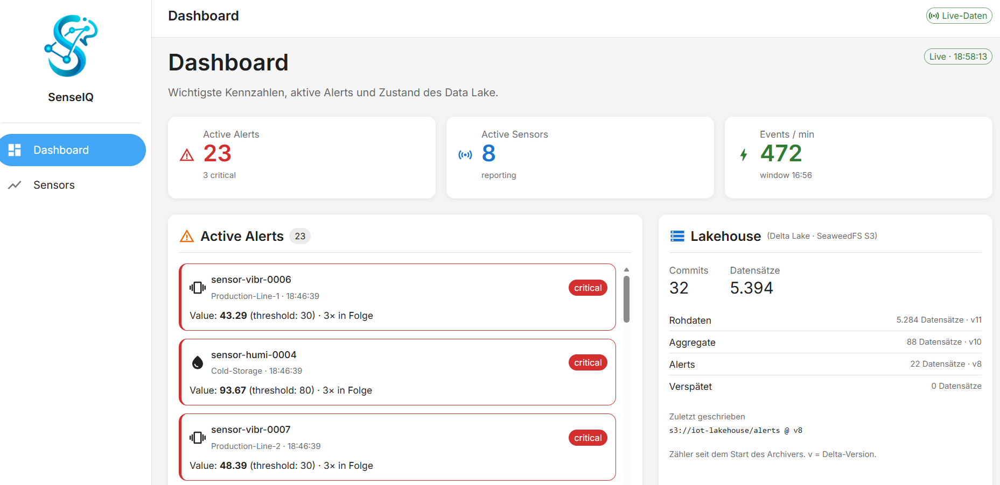

**Dashboard im Live-Betrieb.** Der Screenshot belegt vier Dinge auf einmal:

- **Reale Anbindung** — der Chip oben rechts steht auf „Live-Daten“ (grün) mit
  dem Zeitstempel der letzten Aktualisierung, `18:58:13`. Wäre das Backend nicht
  erreichbar, stünde dort rot „Backend nicht erreichbar“ und die Ansicht bliebe
  leer, statt Ersatzdaten zu zeigen (siehe [Abschnitt 7](#7-user-facing-ui)).
- **Die Pipeline verarbeitet** — die Kennzahlenzeile weist für diesen Lauf
  8 meldende Sensoren und 472 Events im jüngsten Fenster aus; alle drei
  Kennzahlen sind aus den abgerufenen Daten berechnet, nicht hinterlegt.
- **Das zustandsbehaftete Alerting greift** — `sensor-humi-0004`
  (Cold-Storage) meldet 93,67 % gegen einen Warn-Schwellwert von 80 und wird als
  `critical` eingestuft, weil auch der kritische Grenzwert von 90 überschritten
  ist. Der Zusatz „3× in Folge“ ist der `breach_count` aus dem Keyed State:
  Genau drei aufeinanderfolgende Überschreitungen lösen den Alarm aus, ein
  einzelner Ausschlag nicht (siehe
  [Abschnitt 5.4](#54-zustandsbehaftetes-alerting)).
- **Das Lakehouse füllt sich** — 32 Commits, 5 394 Datensätze, aufgeschlüsselt
  nach den vier Delta-Tabellen samt ihrer jeweils aktuellen Version
  (`Rohdaten … v11`, `Aggregate … v10`, `Alerts … v8`). Zuletzt geschrieben
  wurde `s3://iot-lakehouse/alerts @ v8`. `Verspätet · 0 Datensätze` heißt: In
  diesem Lauf hat kein Event seine Allowed Lateness überschritten.

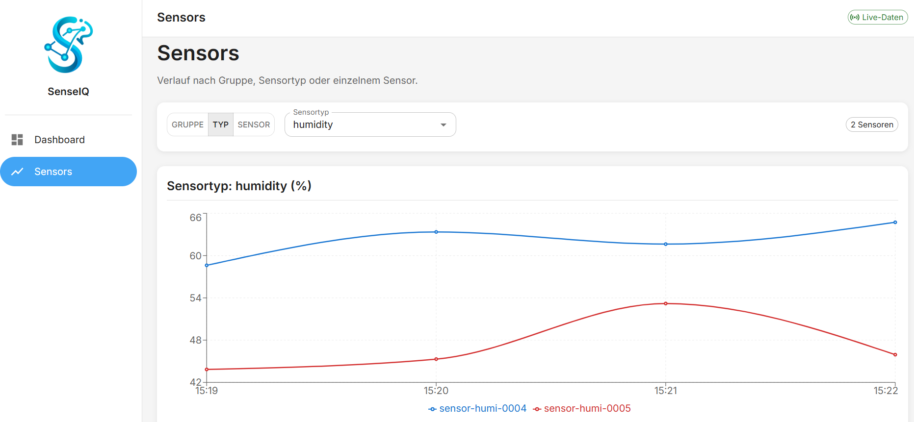

**Sensoransicht, Dimension „Typ“.** Die Fensteraggregate des Typs `humidity`
als Ø-Linie je Sensor — `sensor-humi-0004` und `sensor-humi-0005`, vom Chip
rechts als „2 Sensoren“ bestätigt. Die Stützstellen liegen exakt eine Minute
auseinander (15:19 … 15:22) und belegen damit das Ein-Minuten-Tumbling-Window
aus [Abschnitt 5.3](#53-fenster-aggregation).

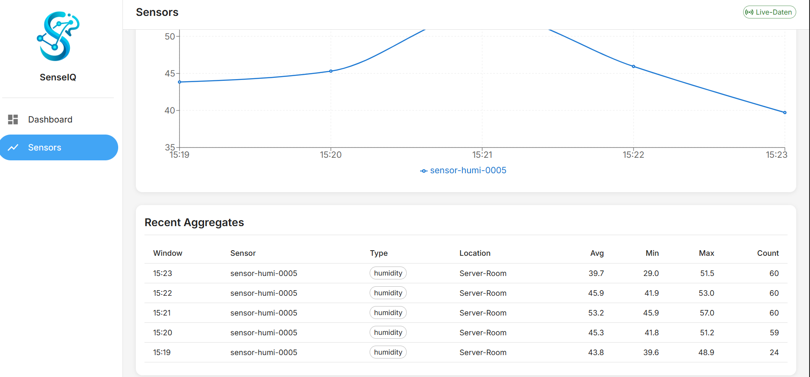

**Sensoransicht, Dimension „Sensor“, mit der Tabelle „Recent Aggregates“.**
Hier ist das Ergebnis der Fensterfunktion unmittelbar ablesbar: je Minutenfenster
`Avg`, `Min`, `Max` und `Count` für `sensor-humi-0005`. Der `Count` von 60 je
Fenster passt exakt zum Sendeintervall von 1 s (`simulator.interval`) — 60
Messwerte pro Minute und Sensor, was Fensterlänge und Ingestion-Rate zugleich
bestätigt. Das erste Fenster (15:19) zeigt 24 statt 60: ein angeschnittenes
Fenster, das erst mit dem Beginn der Erfassung gefüllt wurde.

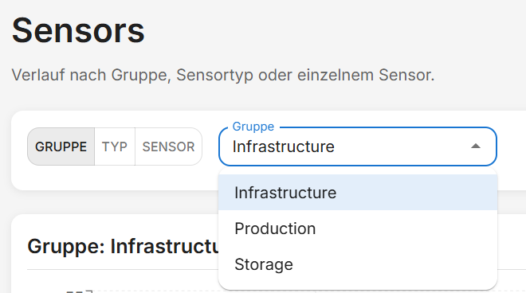

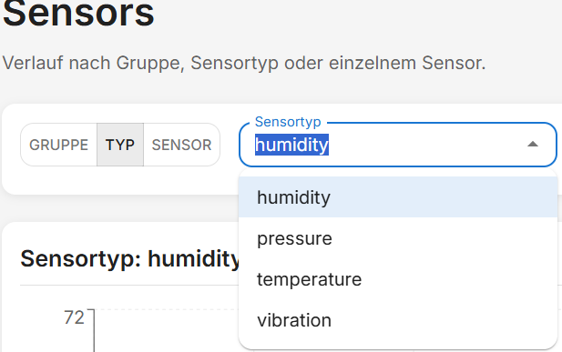

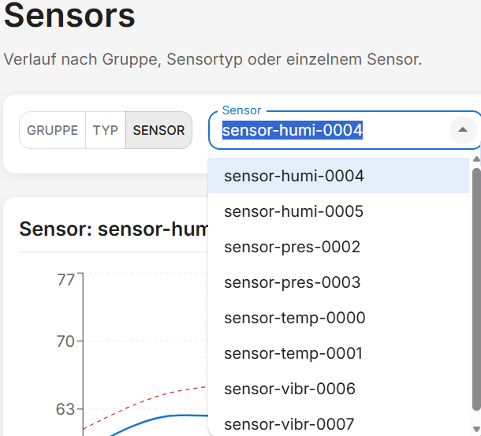

**Die drei Auswertungsdimensionen.** Alle drei Auswahllisten sind aus den
gelieferten Daten aufgebaut, nicht im Frontend hinterlegt: Die Gruppen
(`Infrastructure`, `Production`, `Storage`) stammen aus der **Anreicherung im
Flink-Job** ([Abschnitt 5.1](#51-anreicherung)) und erscheinen in der
Oberfläche nur deshalb, weil der Katalog sie an jedes Aggregat gehängt hat.
Sensortypen und Sensor-IDs füllen die beiden anderen Listen ebenso aus dem
Strom. Der Weg vom Sensorkatalog über den Flink-Job bis in ein Dropdown der
Oberfläche ist damit lückenlos belegt.

Der zugehörige Bedienablauf ist in
[Abschnitt 7](#bedienablauf-für-die-demo) Schritt für Schritt beschrieben.

### Ingestion: Simulator und Kafka

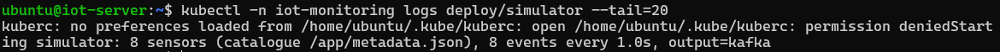

**Der Simulator baut seine Flotte aus dem Katalog.** Die Startzeile nennt
beides, was den Durchsatz bestimmt: den Katalog `/app/metadata.json` als Quelle
der Sensorliste und das Sendeintervall von 1,0 s. Beides ist Konfiguration —
genau der in [Abschnitt 1](#1-use-case-und-motivation) beschriebene Punkt, dass
Umfang und Takt der Anlage nicht im Code stehen. `output=kafka` belegt, dass der
Simulator direkt in den Broker schreibt und nicht den Umweg über die REST-API
nimmt.

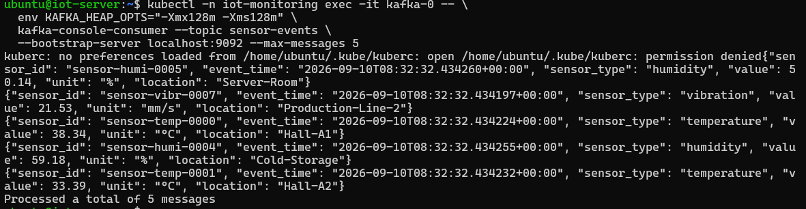

**Die Events liegen im Broker.** Ein `kafka-console-consumer` direkt im
Kafka-Pod zieht fünf Records aus `sensor-events` — unabhängig von Flink, Backend
und UI, also ein Nachweis der Ingestion für sich allein. Die Nutzlast ist exakt
das Wire-Format aus [Abschnitt 5](#5-processing-logik): `sensor_id`,
`event_time`, `sensor_type`, `value`, `unit`, `location`. Zwei Details sind
aussagekräftig: Es erscheinen mehrere Sensortypen (`humidity`, `vibration`,
`temperature`) mit ihren jeweiligen Einheiten nebeneinander, und alle fünf
`event_time`-Werte liegen innerhalb weniger Mikrosekunden
(`08:32:32.4342…`) — die gesamte Flotte meldet pro Takt einmal, wie es der
Simulator vorsieht. Anreicherungsfelder wie `group` fehlen hier noch; sie
entstehen erst im Flink-Job.

### Verarbeitung: der Flink-Cluster

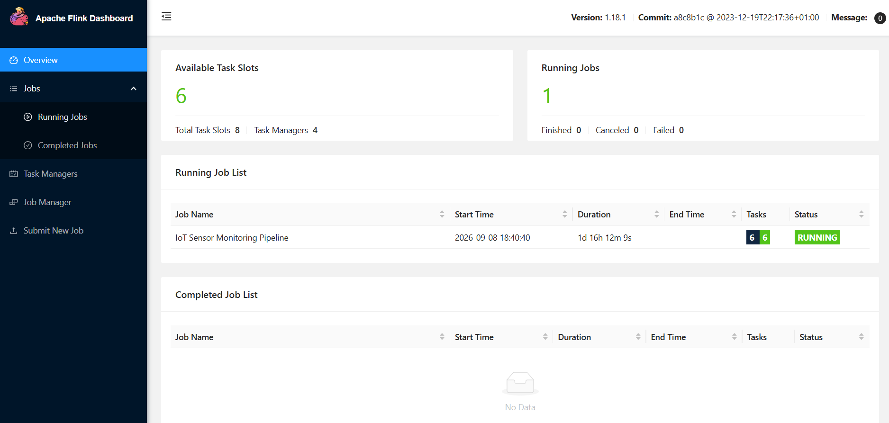

**Der Job läuft dauerhaft.** Das Flink-Dashboard (Version 1.18.1) zeigt die
Pipeline `IoT Sensor Monitoring Pipeline` seit über einem Tag im Zustand
`RUNNING`, bei `Failed 0` und `Canceled 0` — die Verarbeitung überstand also
auch den Neustart einzelner Komponenten (siehe
[Abschnitt 5.6](#56-fehlertoleranz)). Die Slot-Bilanz belegt zugleich die
Trennung von Kapazität und Parallelität aus
[Abschnitt 8](#durchsatz-horizontal-skalierbar): Vier TaskManager stellen
8 Task Slots bereit — der Stand nach der weiter unten gezeigten Skalierung —,
von denen bei `flink.parallelism = 2` sechs frei bleiben. Zusätzliche
TaskManager erhöhen die Kapazität; genutzt wird sie erst, wenn die Parallelität
mitwächst.

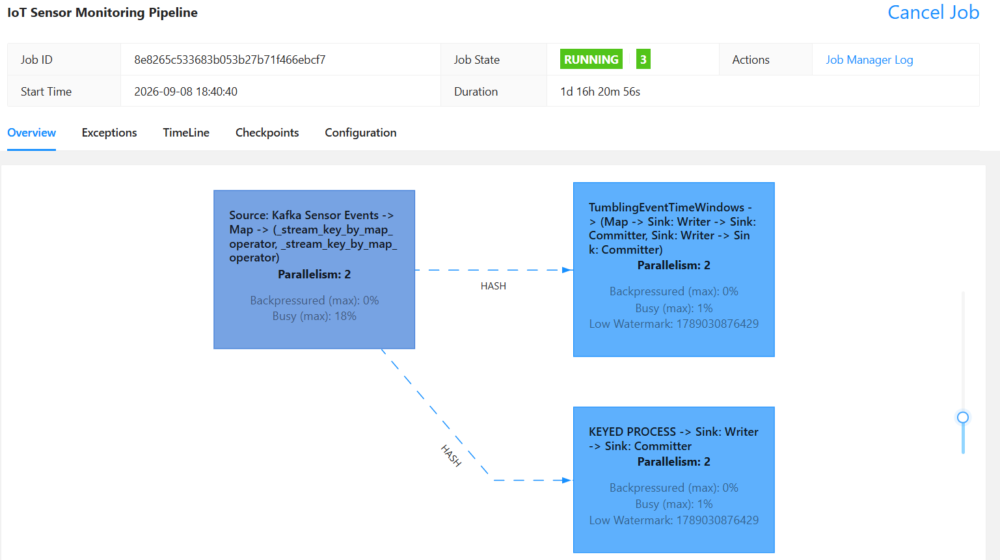

**Der Graph ist der aus [Abschnitt 5](#5-processing-logik), eins zu eins.**
Aus der Quelle `Source: Kafka Sensor Events -> Map` — Kafka-Consumer plus
Anreicherung — führen zwei mit `HASH` beschriftete Kanten weg; das ist das
`key_by(sensor_id)`, das beide Zweige unabhängig voneinander nach Sensor
partitioniert. Der obere Zweig ist das Ein-Minuten-Fenster
(`TumblingEventTimeWindows`), der untere die zustandsbehaftete Alarmlogik
(`KEYED PROCESS`). Bemerkenswert ist der Knoteninhalt des Fensterzweigs: Er
trägt **zwei** Sink-Ketten (`Sink: Writer -> Sink: Committer` zweimal) — die
Aggregate und, über den Side Output, die verspäteten Events aus
[Abschnitt 5.5](#55-umgang-mit-verspäteten-daten). Der Side Output ist damit
kein Papierkonzept, sondern im ausgeführten Graphen sichtbar.

Zwei Laufzeitwerte runden das ab: Beide Zweige melden einen gesetzten
`Low Watermark` (`1789030876429` in Epoch-Millisekunden, also der
10.09.2026 09:01 UTC) — die Event-Zeit schreitet fort, Fenster werden also
tatsächlich geschlossen und nicht nur angelegt. Und `Backpressured (max): 0 %`
bei `Busy (max): 18 %` in der Quelle heißt: Die Verarbeitung hält der Ingestion
mühelos stand, die gezeigte Last schöpft die Auslegung nicht aus.

### Speicherung: das Lakehouse auf SeaweedFS

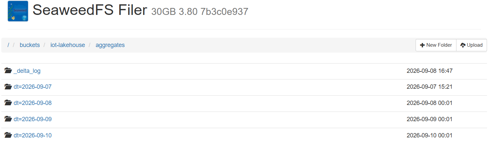

**Partitionierung nach Ereigniszeit, im Objektspeicher nachgezählt.** Der
SeaweedFS-Filer zeigt `buckets/iot-lakehouse/aggregates` mit genau dem Layout
aus [Abschnitt 6](#layout-und-partitionierung): das Verzeichnis `_delta_log`
neben den Tagespräfixen `dt=2026-09-07` bis `dt=2026-09-10`.

Der Nachweis für die **Ereigniszeit** steckt in der rechten Spalte. Die erste
Partition entsteht um 15:21 — mit dem Beginn des Laufs. Jede folgende trägt als
Anlagezeit **00:01**. Wären die Daten nach Ankunftszeit abgelegt, wäre das
Zufall; weil sie nach `event_time` partitioniert werden, ist es zwingend: Kurz
nach Mitternacht UTC trägt das erste Event den neuen Tag im Zeitstempel und legt
damit die neue Partition an. Dass `_delta_log` einen jüngeren Zeitstempel hat
als alle Datenpartitionen, entspricht dem Commit-Modell — der Log wächst mit
jedem Flush weiter, auch wenn dieser in eine ältere Partition schreibt.

### Serving: die REST-Schicht

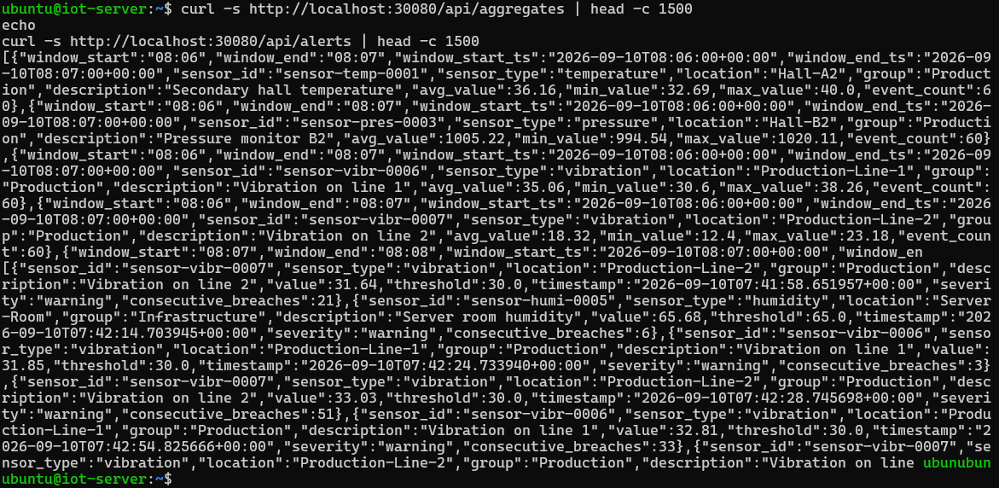

**Die Serving-Schicht liefert, was die Pipeline erzeugt hat.** Zwei `curl`s
gegen `:30080` — den NodePort des Frontends, die Anfragen laufen also durch den
nginx-Reverse-Proxy und nicht am Auslieferungsweg der UI vorbei
([Abschnitt 4](#4-komponenten-und-datenfluss)).

`GET /api/aggregates` zeigt Fensterergebnisse, die **alle drei
Verarbeitungsschritte durchlaufen haben**: Anreicherung (`group`, `description` stehen an
jedem Record, obwohl sie im Rohevent oben fehlen), Fensterbildung
(`window_start_ts` / `window_end_ts` exakt eine Minute auseinander) und
Aggregation (`avg_value`, `min_value`, `max_value`, `event_count: 60` — sechzig
Messwerte je Minute bei 1 s Takt, was Fensterlänge und Ingestion-Rate
gegenseitig bestätigt).

`GET /api/alerts` belegt den **Keyed State**: `consecutive_breaches` steht bei
21, 33 und 51 — die Zähler laufen über Dutzende Events weiter und werden nicht
je Event neu gebildet. Ein Alarm entsteht ab der dritten Überschreitung in Folge
und bleibt bestehen, solange der Sensor über seinem Schwellwert liegt
([Abschnitt 5.4](#54-zustandsbehaftetes-alerting)). Die `threshold`-Werte
unterscheiden sich dabei je Sensor (`30.0` für Vibration, `65.0` für
Luftfeuchtigkeit) — sie stammen aus dem Katalog, nicht aus einer globalen
Konstante.

### Beispiel-Outputs der Pipeline

Ein Event aus `sensor-events` — das Wire-Format des Simulators, zugleich der
Inhalt der Tabelle `raw`:

```json
{
  "sensor_id": "sensor-temp-0000",
  "event_time": "2026-09-07T12:04:31.412+00:00",
  "sensor_type": "temperature",
  "value": 58.91,
  "unit": "°C",
  "location": "Hall-A1"
}
```

Ein Aggregat aus `sensor-aggregates` — das Ergebnis der Fensterfunktion,
angereichert um `group` und `description`:

```json
{
  "window_start": "12:04",
  "window_end": "12:05",
  "window_start_ts": "2026-09-07T12:04:00+00:00",
  "window_end_ts": "2026-09-07T12:05:00+00:00",
  "sensor_id": "sensor-temp-0000",
  "sensor_type": "temperature",
  "location": "Hall-A1",
  "group": "Production",
  "description": "Main hall temperature sensor",
  "avg_value": 59.12,
  "min_value": 57.8,
  "max_value": 61.44,
  "event_count": 60
}
```

Ein Alarm aus `sensor-alerts` — `consecutive_breaches` ist der mitgeführte
Zustand aus der Alarmlogik, `threshold` der Schwellwert aus dem Katalog:

```json
{
  "sensor_id": "sensor-temp-0000",
  "sensor_type": "temperature",
  "location": "Hall-A1",
  "group": "Production",
  "description": "Main hall temperature sensor",
  "value": 71.2,
  "threshold": 60.0,
  "timestamp": "2026-09-07T12:06:03.117+00:00",
  "severity": "critical",
  "consecutive_breaches": 3
}
```

Eine Delta-Tabelle im Lakehouse — `s3://iot-lakehouse/aggregates/`:

```
aggregates/_delta_log/00000000000000000000.json      <- Version 0: Protokoll + Schema
aggregates/_delta_log/00000000000000000001.json      <- Version 1: ein Flush
aggregates/dt=2026-09-07/hour=12/part-00001-....parquet
aggregates/dt=2026-09-07/hour=13/part-00001-....parquet
```

Gelesen wird sie ohne Konvertierungsschritt, etwa mit
`DeltaTable("s3://iot-lakehouse/aggregates", storage_options=...).to_pandas()`.
Die Partitionswerte `dt` und `hour` sind dabei reguläre Spalten der Tabelle.

Eine Antwort von `GET /api/history` — dieselbe Fachlichkeit aus dem Lakehouse
statt aus dem Arbeitsspeicher, mit der gelesenen Tabellenversion in der Antwort:

```json
{
  "dataset": "aggregates",
  "version": 10,
  "count": 1,
  "rows": [
    {
      "window_start": "12:04",
      "window_start_ts": "2026-09-07T12:04:00+00:00",
      "sensor_id": "sensor-temp-0000",
      "avg_value": 59.12,
      "event_count": 60,
      "dt": "2026-09-07",
      "hour": "12"
    }
  ]
}
```

### Deployment auf Kubernetes

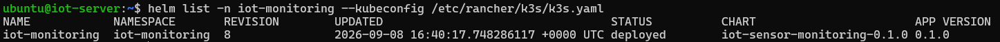

**Der gesamte Stack ist eine einzige Helm-Release.** `helm list` weist
`iot-monitoring` mit dem Chart `iot-sensor-monitoring-0.1.0` im Status
`deployed` aus. Die `REVISION 8` ist dabei der eigentliche Beleg: Der Stack
wurde nicht einmalig aufgesetzt, sondern acht Mal über `helm upgrade`
fortgeschrieben — Änderungen laufen über das Chart, nicht über Eingriffe am
Cluster ([Abschnitt 9](#9-deployment-anleitung)).

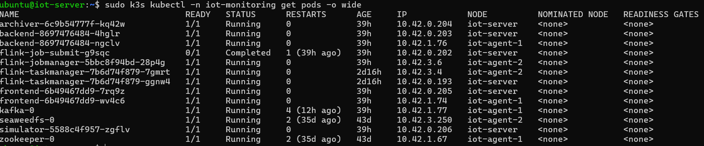

**Alle Workloads laufen, verteilt über drei Knoten.** Die Spalte `NODE` zeigt
die Pods auf `iot-server`, `iot-agent-1` und `iot-agent-2` — die drei von
Terraform provisionierten VMs. Drei Beobachtungen decken sich mit den
Festlegungen aus [Abschnitt 8](#8-kubernetes-deployment):

- `backend`, `frontend` und `flink-taskmanager` laufen mit je zwei Pods, und der
  Scheduler hat sie **auf verschiedene Knoten** gelegt. Der Ausfall einer VM
  nimmt also keine dieser Rollen vollständig aus dem Betrieb.
- `archiver` läuft mit **genau einem** Pod — die Ein-Schreiber-Garantie, die
  eine Delta-Tabelle verlangt.
- `flink-job-submit` steht auf `Completed`: Die Pipeline wurde beim Rollout
  **deklarativ als Kubernetes-`Job`** eingereicht, nicht von Hand per
  `flink run`.

Die `AGE`-Spalte belegt nebenbei die Stabilität: SeaweedFS und Zookeeper laufen
seit 43 Tagen, die TaskManager seit über zwei Tagen ohne Neustart.

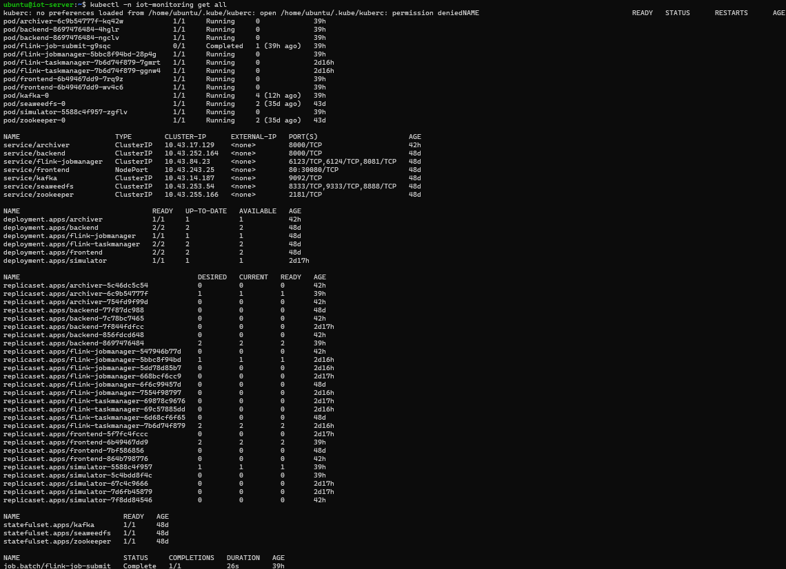

**Die vollständige Objektliste des Namespace.** Sie zeigt die Aufteilung der
Workload-Typen, die [Abschnitt 8](#workloads) begründet: `Deployments` für die
zustandslosen Rollen (Backend, Frontend, Simulator, Flink, Archiver),
`StatefulSets` für die zustandsbehafteten Systeme (`kafka`, `seaweedfs`,
`zookeeper`, jeweils `1/1`) und ein `Job` (`flink-job-submit`, `Complete`,
Laufzeit 26 s) für die Job-Einreichung. Bei den Services ist `frontend` als
einziger ein `NodePort` (`80:30080/TCP`) — alles Übrige bleibt `ClusterIP` und
damit clusterintern erreichbar. Das ist der in
[Abschnitt 7](#7-user-facing-ui) beschriebene Zuschnitt: **ein** exponierter
Port, hinter dem nginx die API-Pfade auf Backend und Archiver verteilt.

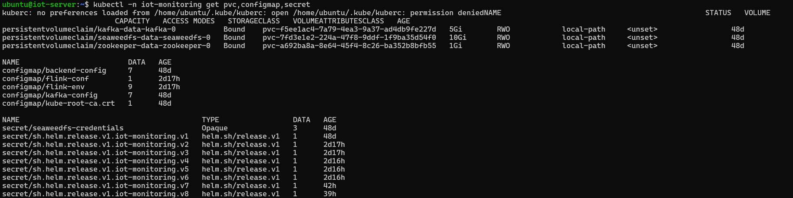

**Konfiguration und Zustand sind sauber getrennt.** Alle drei PVCs
(`kafka-data` 5 Gi, `seaweedfs-data` 10 Gi, `zookeeper-data` 1 Gi) stehen auf
`Bound` und wurden — wie in [Abschnitt 8](#konfiguration-und-secrets)
beschrieben ohne `storageClassName` angefordert — von der Default-StorageClass
`local-path` bedient. Die ConfigMaps tragen die Anwendungskonfiguration
(`backend-config`, `kafka-config`, `flink-conf`, `flink-env`), das Secret
`seaweedfs-credentials` die S3-Zugangsdaten. Kein Wert davon steckt in einem
Image: Der Tausch des Objektspeichers aus
[Abschnitt 4](#begründete-abweichungen) ist genau eine Änderung an diesen
beiden Objekten. Die acht `sh.helm.release`-Secrets daneben sind die
Versionshistorie der Release — die Grundlage für `helm rollback`.

### Horizontale Skalierung im laufenden Betrieb

Der folgende Dreischritt führt die Skalierung aus
[Abschnitt 8](#demonstration) am laufenden Cluster vor.

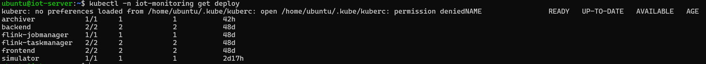

**Ausgangszustand.** `backend`, `frontend` und `flink-taskmanager` stehen auf
`2/2`, `archiver` auf `1/1`.

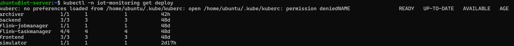

**Nach der Skalierung.** `backend` und `frontend` stehen auf `3/3`,
`flink-taskmanager` auf `4/4` — alle drei mit `READY = UP-TO-DATE = AVAILABLE`,
die neuen Pods sind also nicht nur angelegt, sondern bedienen Anfragen. Die
entscheidende Zeile ist die, die sich **nicht** geändert hat: `archiver` steht
weiterhin auf `1/1`. Die Ein-Schreiber-Grenze ist keine Absichtserklärung im
Text, sondern im Deployment verankert und übersteht eine Skalierung des
Gesamtsystems ([Abschnitt 8](#durchsatz-horizontal-skalierbar)).

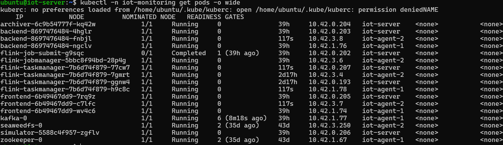

**Wo die neuen Pods gelandet sind.** An der `AGE`-Spalte sind sie unmittelbar zu
erkennen: `backend-…-fnbjl`, `frontend-…-c7lfc` sowie die TaskManager
`…-77cw7` und `…-h9c8c` sind rund zwei Minuten alt, alle übrigen Pods laufen
seit Stunden bzw. Tagen weiter. Skaliert wurde also **ohne Neustart des
Bestands** — kein Rollout, keine Unterbrechung der Verarbeitung. Der Scheduler
hat die neuen Replicas zudem wieder über die drei Knoten verteilt.

Dass die vier TaskManager anschließend acht Task Slots bereitstellen, von denen
der Job sechs ungenutzt lässt, ist im Flink-Dashboard weiter oben zu sehen —
und der Grund, warum `flink.parallelism` neben `flink.taskmanager.replicas` als
zweite Stellschraube existiert.

## 12. Grenzen des Prototyps und Ausblick

### Bewusst gezogene Grenzen

Der Prototyp deckt die Streaming-Pipeline durchgängig ab. Der Aufwand ist gezielt
dort investiert, wo die fachliche Substanz liegt — Event-Time-Verarbeitung,
zustandsbehaftetes Alerting, Partitionierung nach Ereigniszeit, replikationsfähige
Serving-Schicht. Die folgenden Punkte sind entsprechend außerhalb des Scopes
geblieben; sie sind hier vollständig benannt, damit klar ist, wo der Prototyp
endet und der Produktivbetrieb begänne.

**Daten und Verarbeitung**

- Die Messwerte sind **synthetisch** — es steht keine Sensor-Hardware zur
  Verfügung. Der Simulator ist deshalb bewusst kein Zufallsgenerator, sondern
  bildet mit Random Walk, Mean Reversion und gezielten Ausschlägen die
  Eigenschaften nach, auf die die Verarbeitung reagieren soll.
- Die Zustellgarantie ist **At-least-once**, nicht Exactly-once. Für Aggregate
  und Alarme ist das die angemessene Stufe; echtes Exactly-once verlangt
  transaktionale Sinks und damit einen spürbaren Durchsatz- und
  Komplexitätsaufschlag.
- Die Alarmlogik prüft **obere Grenzwerte**, weil die überwachten Größen dort
  ihre kritischen Zustände haben. Untere Schranken wären dieselbe
  Zustandslogik mit umgekehrtem Vergleich.
- `allowed_lateness` kann ein Fenster **mehrfach** ausgeben — die spätere
  Fassung ist die vollständigere. Konsumenten sollten daher je
  `(sensor_id, window_start_ts)` die jüngste Fassung verwenden; die
  Diagrammansicht des Dashboards verfährt bereits so, eine allgemeine
  Deduplizierung stromabwärts gibt es nicht.

**Speicher**

- Die Speicherschicht ist ein **Lakehouse** (Parquet + Delta), aber ohne
  Tabellenpflege: Es läuft weder `OPTIMIZE` (Verdichten der pro Flush
  entstehenden Dateien) noch `VACUUM` (Entfernen alter Versionen). Bei
  Dauerbetrieb wüchsen damit sowohl die Zahl kleiner Parquet-Dateien als
  auch das Transaktionslog. Für die Laufzeit des Prototyps ist das
  unerheblich, im Produktivbetrieb wäre es ein Wartungsjob.
- Der Schreibpfad ist **bewusst nicht skalierbar**: eine Replica, weil
  SeaweedFS 3.80 bedingte `PUT`s nicht durchsetzt und Delta deshalb
  konkurrierende Schreiber nicht erkennen könnte
  ([Abschnitt 8](#8-kubernetes-deployment)). Ein Objektspeicher mit
  belastbarem `If-None-Match` — oder ein Lock-Provider — würde diese
  Einschränkung aufheben.
- Das Archiv ist über `GET /api/history` **lesend angebunden**
  ([Abschnitt 6](#6-speicherkonzept)), das **Dashboard nutzt diesen Weg aber
  noch nicht** — es bezieht seine Daten weiterhin direkt aus dem Stream. Die
  Abfrage steht damit über die API zur Verfügung, eine Oberfläche für
  historische Auswertungen fehlt noch.

**Betrieb**

- Die Serving-Schicht hält ihr Fenster auf die Ergebnisse **im Arbeitsspeicher**
  (`deque`, 1000 Aggregate / 500 Alarme). Das macht die Antwortzeiten kurz und
  die Replikation unkompliziert; im Gegenzug beginnt eine frisch gestartete
  Replica mit dem laufenden Stream statt mit der Historie. Dauerhaft
  gespeichert wird im Archiv.
- Kafka, Zookeeper und SeaweedFS sind für dieses Cluster mit je einer Replica
  dimensioniert (Begründung und Ausbauweg in
  [Abschnitt 8](#8-kubernetes-deployment)). Für den Durchsatz des Prototyps ist
  das ausreichend; Ausfallsicherheit wäre der nächste Ausbauschritt, zumal die
  PVCs über `local-path` knotengebunden sind.
- Flink-Checkpoints liegen im JobManager-Speicher, was den betrieblich
  häufigen Fall — den Ausfall eines TaskManagers — abdeckt (siehe
  [Abschnitt 5.6](#56-fehlertoleranz)).
- **Authentifizierung, Autorisierung und Transportverschlüsselung** sind nicht
  Teil des Scopes; die Anwendung ist für den Betrieb in einem geschlossenen
  Netz ausgelegt. Entsprechend sind auch die S3-Zugangsdaten als Defaults im
  Chart hinterlegt — sie gehören für jeden exponierten Betrieb in einen
  Secret-Store.
- Skaliert wird **deklarativ über das Chart**, nicht lastabhängig über eine HPA.
- In der Oberfläche werden **zwei Zeitbezüge nebeneinander** angezeigt: Die
  Fensterlabels (`window_start`) sind die von Flink erzeugten UTC-Zeitstempel und
  werden unverändert dargestellt, während Alarmzeiten und der Live-Zeitstempel
  über `toLocaleTimeString()` in der Zeitzone des Browsers erscheinen. Auf einem
  Rechner in MESZ stehen deshalb zwei Uhrzeiten im selben Bild, die zwei Stunden
  auseinanderliegen — im Dashboard-Screenshot in
  [Abschnitt 11](#11-screenshots-und-nachweise) gut zu sehen. Fachlich ist
  nichts falsch, die Anzeige sollte aber eine Zeitzone konsequent durchhalten.
- Verifiziert wurde **manuell gegen das laufende Cluster**; automatisierte Tests
  sind nicht Teil der Abgabe.

### Ausblick

1. **Query-Schicht** (DuckDB oder Trino) auf dem Lakehouse, damit historische
   Auswertungen nicht mehr am fehlenden Lesepfad scheitern — der größte
   verbleibende Gewinn, und mit Delta-Tabellen ohne Konvertierungsschritt
   erreichbar.
2. **Tabellenpflege**: `OPTIMIZE` zum Verdichten der Flush-Dateien und
   `VACUUM` zum Aufräumen alter Versionen, als periodischer `CronJob`.
3. **Dauerhafte Checkpoints** nach S3 plus JobManager-HA.
4. **Autoskalierung** anhand des Kafka-Consumer-Lag statt fester Replica-Zahlen.
5. **Authentifizierung** für UI und API sowie Secrets aus einem echten
   Secret-Store.
6. **Monitoring** mit Prometheus und Grafana — Flink-Metriken, Consumer-Lag,
   Archivierungsrate.

---

## Eigenständigkeit und Innovation

Die Prüfungsleistung sieht Bonuspunkte für nachvollziehbar begründete
Eigenständigkeit vor und nennt als Beispiele ausdrücklich einen Objektspeicher
anstelle von HDFS, ein alternatives Tabellenformat sowie Funktionalität über den
geforderten Mindestumfang hinaus. Dieser Abschnitt bündelt genau das: Die
Entscheidungen sind an ihrer jeweiligen Stelle ausführlich begründet, die
Tabelle fasst sie zusammen, damit sie nicht einzeln gesucht werden müssen.

**Zur Lesart der mittleren Spalte.** Sie nennt jeweils die etablierte
Alternative — durchweg ein solider und für den allgemeinen Fall richtiger Weg,
und in den meisten Zeilen derjenige, den man in einem Produktivsystem auch
erwarten würde. Dass hier anders entschieden wurde, ist deshalb kein Einwand
gegen diese Alternative, sondern folgt aus den Randbedingungen dieses Projekts:
drei kleine VMs, die sich Broker, Stream-Engine, Objektspeicher und Anwendung
teilen, ein Prototyp ohne Betriebsmannschaft, und ein Schwerpunkt, der bewusst
auf der Streaming-Verarbeitung liegt. Fielen diese Randbedingungen weg — größeres
Cluster, echter Produktivbetrieb —, wäre in mehreren Zeilen die Alternative die
bessere Wahl. Wo das zutrifft, ist es an der jeweiligen Stelle benannt und in
[Abschnitt 12](#12-grenzen-des-prototyps-und-ausblick) zusammengefasst.

| Entscheidung                                          | Etablierte Alternative                  | Ausschlaggebend unter den Randbedingungen dieses Projekts                                                                                                                                                   | Nachzulesen                                             |
| ----------------------------------------------------- | --------------------------------------- | ----------------------------------------------------------------------------------------------------------------------------------------------------------------------------------------------------------- | ------------------------------------------------------- |
| **SeaweedFS** als Objektspeicher                      | HDFS (NameNode + DataNodes) oder MinIO  | Auf drei geteilten VMs bleiben so die Ressourcen bei der Verarbeitung: ein Prozess, 256 Mi. Die Wahl legt zudem nichts fest — der Wechsel zu MinIO oder AWS S3 sind drei Konfigurationswerte, kein Codepfad | [4](#begründete-abweichungen)                           |
| **Delta Lake** als Tabellenformat                     | Iceberg (dem eigenen Vorschlag)         | delta-rs hält das Transaktionslog im Bucket — kein Katalogdienst, kein zusätzlicher Pod, kein PVC, keine JVM                                                                                                | [6](#format-parquet-mit-delta-als-tabellenformat)       |
| **Migration Data Lake → Lakehouse** im Projektverlauf | Verbleib bei JSON Lines                 | Atomare Commits, definierte Lesestände, Spaltenformat, erzwungenes Schema und Time Travel — fünf Eigenschaften, die die eigene erste Fassung nicht bot                                                      | [6](#vom-data-lake-zum-lakehouse--warum-migriert-wurde) |
| **Archiver als eigener Dienst**                       | S3-Sink im Flink-Job                    | Kafka bleibt die einzige Integrationsgrenze; erlaubt das Mitschreiben der Rohdaten ohne Eingriff in den Verarbeitungsgraphen                                                                                | [4](#begründete-abweichungen)                           |
| **Vier Datasets statt eines**, inkl. `raw` und `late` | nur Ergebnisse archivieren              | `raw` macht Kappa-Reprocessing überhaupt erst möglich, `late` macht Datenverlust auditierbar statt unsichtbar                                                                                               | [6](#vier-datasets-vier-delta-tabellen)                 |
| **Partitionierung nach Ereigniszeit**                 | Partitionierung nach Ankunftszeit       | Ein verspätetes oder erneut eingespieltes Event landet in der Partition, in die es fachlich gehört — nur so ist eine Partition jemals vollständig                                                           | [6](#layout-und-partitionierung)                        |
| **Quarantäne für abgewiesene Records**                | Batch scheitern lassen                  | Verhindert die Endlosschleife aus fehlgeschlagenem Flush und nicht committetem Offset; der Verlust bleibt nachlesbar                                                                                        | [6](#umgang-mit-abgewiesenen-records)                   |
| **Gegensätzliche Consumer-Group-Strategien**          | eine Strategie für beide Consumer       | Serving braucht jede Partition in jeder Replica, Archivierung genau eine Zustellung — dasselbe Image, zwei bewusst verschiedene Gruppenmodelle                                                              | [8](#durchsatz-horizontal-skalierbar)                   |
| **Declarative Job-Einreichung** als Kubernetes-`Job`  | `flink run` nach dem Rollout            | Ein `helm install` bringt damit eine _verarbeitende_ Pipeline hoch statt eines leeren Flink-Clusters; der Job erkennt eine bereits laufende Pipeline und bleibt dadurch wiederholbar                        | [8](#workloads)                                         |
| **Terraform-Bootstrap in einem `apply`**              | Cluster schrittweise von Hand aufsetzen | VMs, k3s, Image-Build, Helm-Rollout und die IPv6-NodePort-Brücke reproduzierbar aus einer Quelle                                                                                                            | [9](#weg-a--terraform-empfohlen-ein-befehl)             |
| **Ein-Schreiber-Garantie über das Deployment**        | `AWS_S3_ALLOW_UNSAFE_RENAME`            | Die Notluke von delta-rs würde den Konflikt verbergen statt lösen; die Korrektheit wird stattdessen im Deployment hergestellt und belegt                                                                    | [8](#durchsatz-horizontal-skalierbar)                   |

Der Punkt, an dem der Prototyp am deutlichsten über den Mindestumfang
hinausgeht, ist die **Behandlung dessen, was schiefgeht**: zu späte Events, vom
Schema abgewiesene Records und die Grenze der Schreib-Parallelität sind nicht
weggelassen, sondern gemessen, dokumentiert und in einen eigenen, nachlesbaren
Kanal geleitet.

---

## Team und Eigenanteil

| Person          | Verantwortungsbereich                                                      |
| --------------- | -------------------------------------------------------------------------- |
| Tobias Dietze   | Backend Engineer — FastAPI, Kafka-Anbindung, Archivierung nach SeaweedFS   |
| Tobias Meier    | Frontend Engineer — React-UI, Visualisierung, Anbindung an die Serving-API |
| Alexia Adams    | Documentation Engineer — README als alleiniges Berichtsdokument            |
| Emilio Dyringer | System Architect — Backend Design, Datenbanken                             |
| Vincent Brück   | System Architect — Kubernetes, Deployment                                  |

Die Git-Historie dokumentiert den Verlauf der Umsetzung seit dem 18.06.2026:
Die Arbeit lief über Feature-Branches mit Pull Requests (`feat/lakehouse-delta`,
`feat/senseiq-ui-and-pipeline-config`, `fix/pipeline-bugs`), die Commits folgen
durchgängig Conventional Commits. Der Verlauf ist damit nachvollziehbar den
oben genannten Bereichen zuzuordnen.

---

## Entwicklung

Für die inhaltliche Beschreibung des Systems ist die restliche README
zuständig; dieser Abschnitt beschreibt nur den Arbeitsablauf im Repo:
lokale Prüfung, Linter, Namenskonventionen für Branches und Commits.
Ausführlicher steht das in [`CONTRIBUTING.md`](CONTRIBUTING.md).

**Lokale Prüfung.** Auf `main` sind Tests und Linter grün; das soll auf
jedem Zweig so bleiben.

```bash
# Python: Tests und Lint
python3 -m venv .venv && source .venv/bin/activate
pip install -r requirements-dev.txt
pytest
ruff check .

# Frontend: Lint und Build
cd frontend
npm install
npm run lint
npm run build
```

Die Unit-Tests decken bislang den Katalog-Loader des Simulators und die
Partitionierungslogik des Archivers ab; Details in
[`tests/README.md`](tests/README.md). Die Ruleset-Auswahl des Linters ist
bewusst schmal — nur Regeln, deren Funde in aller Regel echte Fehler sind,
keine Stilpräferenzen.

**Branches** folgen dem Muster `<kind>/<slug>`, `<kind>` genauso wie das
Commit-Präfix — `feat/`, `fix/`, `docs/`, `test/`, `chore/`, `style/`.
Kein Direkt-Push auf `main`.

**Commit-Nachrichten** folgen
[Conventional Commits](https://www.conventionalcommits.org/): erste Zeile
`<type>(<scope>): <Betreff>`, danach ein Fließtext, der das *Warum*
erklärt (das *Was* zeigt der Diff). Deutsch und Englisch sind beide in
Ordnung — passend zur bearbeiteten Datei.

---

## Repository-Struktur

| Pfad                                         | Inhalt                                                                                                                               | Stufe der Pipeline |
| -------------------------------------------- | ------------------------------------------------------------------------------------------------------------------------------------ | ------------------ |
| [`sensor_simulator.py`](sensor_simulator.py) | Datenerzeugung und Versand nach Kafka                                                                                                | Ingestion          |
| [`flink-job/`](flink-job/)                   | PyFlink-Verarbeitungsgraph ([`job.py`](flink-job/job.py)) und Sensorkatalog ([`metadata.json`](flink-job/metadata.json))             | Stream Processing  |
| [`backend/`](backend/)                       | FastAPI-Serving ([`main.py`](backend/app/main.py)), Archiver ([`archiver.py`](backend/app/archiver.py)), Delta-Schreib- und Lesepfad | Storage + Serving  |
| [`frontend/`](frontend/)                     | React-SPA (Vite, MUI, Recharts) und [`nginx.conf`](frontend/nginx.conf)                                                              | User-facing UI     |
| [`helm/`](helm/)                             | Helm-Chart — der empfohlene Deploy-Weg, alle Stellschrauben in [`values.yaml`](helm/values.yaml)                                     | Kubernetes         |
| [`k8s/`](k8s/)                               | Äquivalente Rohmanifeste für ein Deployment ohne Helm                                                                                | Kubernetes         |
| [`terraform/`](terraform/)                   | OpenStack-VMs und k3s-Bootstrap in einem `apply`                                                                                     | Infrastruktur      |
| [`seaweedfs/`](seaweedfs/)                   | S3-Identitäten des Objektspeichers                                                                                                   | Storage            |
| [`docs/DEPLOYMENT.md`](docs/DEPLOYMENT.md)   | Ausführliche Deployment-Anleitung inklusive Fehlersuche                                                                              | Betrieb            |
| [`tests/`](tests/)                           | Pytest-Suite ([`README`](tests/README.md)) — deckt Katalog-Loader und Partitionierung ab                                             | Entwicklung        |
| [`CONTRIBUTING.md`](CONTRIBUTING.md)         | Kurz-Anleitung für Mitwirkende — Prüfschritte, Branch- und Commit-Konventionen                                                       | Entwicklung        |
| [`assets/screenshots/`](assets/screenshots/) | Eingebettete Nachweise aus [Abschnitt 11](#11-screenshots-und-nachweise)                                                             | Abgabe             |
| [`docker-compose.yml`](docker-compose.yml)   | Lokales Entwicklungssetup der gesamten Kette                                                                                         | Entwicklung        |
| [`deploy.sh`](deploy.sh)                     | Baut die Images und rollt den Stack aus (Helm oder Rohmanifeste)                                                                     | Betrieb            |

---

<p align="center">
  <sub>SenseIQ — Prüfungsleistung Cloud Computing und Big Data, 2026</sub>
</p>
