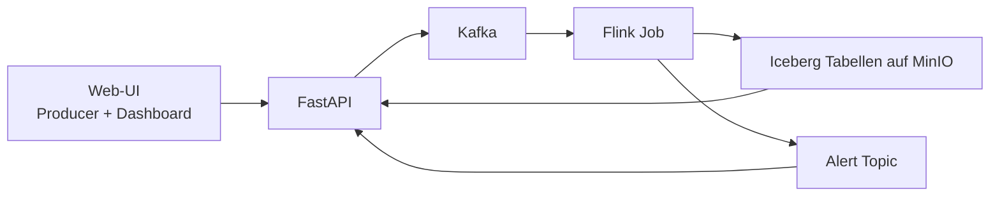
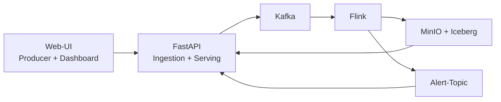

# IoT-Sensormonitoring auf Kubernetes – umsetzbarer Projektvorschlag

## Zielbild

Der Prototyp soll eine kleine, aber vollständige Streaming-Datenpipeline für IoT-Sensordaten zeigen. Wichtig ist nicht maximale technische Breite, sondern ein nachvollziehbarer End-to-End-Datenfluss, der im Rahmen eines Uniprojekts zuverlässig demonstrierbar ist.

Der Fokus liegt daher auf einem **MVP**, der alle Pflichtbestandteile der Prüfungsleistung erfüllt:

- Ingestion eines echten Datenstroms aus einem Simulator
- Stream Processing mit Windowing, Stateful Alerting und einfacher Anreicherung
- Speicherung der Ergebnisse in einem Lakehouse-Format
- Serving über API und Dashboard
- reale Web-UI als Teil der Pipeline
- containerisierter, reproduzierbarer Betrieb auf Kubernetes

---

## 1. Use Case und Motivation

Überwacht wird eine vereinfachte Industrieanlage mit verteilten Sensoren für:

- Temperatur
- Luftfeuchtigkeit
- Druck
- Vibration

Die Sensoren senden fortlaufend Messwerte. Das System soll diese Messwerte in Echtzeit verarbeiten, auffällige Zustände erkennen und für ein Dashboard aufbereiten.

Der Use Case ist gut geeignet, weil er typische Big-Data- und Cloud-Themen in überschaubarem Umfang vereint:

- kontinuierliche Datenströme
- zeitbasierte Aggregation
- zustandsbehaftete Verarbeitung
- persistente Ablage für spätere Auswertung
- sichtbare Benutzeroberfläche für Demo und Nachweis

---

## 2. Warum ist das ein Big-Data-Problem?

| V        | Einordnung im Projekt                                                                                                                                               |
| -------- | ------------------------------------------------------------------------------------------------------------------------------------------------------------------- |
| Volume   | Im Prototyp nur moderat, aber das Datenmodell ist auf viele Sensoren und dauerhaftes Schreiben ausgelegt. Schon synthetisch lassen sich große Eventmengen erzeugen. |
| Velocity | Die Daten treffen als Stream ein und sollen ohne Batch-Lauf zeitnah aggregiert und als Alarm sichtbar werden.                                                       |
| Variety  | Mehrere Sensortypen mit unterschiedlichen Wertebereichen, Einheiten und Standorten; dazu Stammdaten zur Anreicherung.                                               |

Für die Prüfungsleistung ist entscheidend, dass nicht maximale Datenmenge gezeigt wird, sondern dass der Datenfluss als Streaming-Pipeline korrekt modelliert ist.

---

## 3. Architekturentscheidung

Gewählt wird eine **Kappa-Architektur**. Alle Daten laufen durch einen einzigen Streaming-Pfad. Das passt gut zum Projekt, weil:

- der Fokus auf Echtzeitverarbeitung liegt
- der Prototyp keine getrennte Batch-Schicht benötigt
- die Architektur einfacher zu erklären und umzusetzen ist als Lambda
- ein konsistenter End-to-End-Datenfluss für die Bewertung wichtiger ist als maximale Komplexität

### Architekturdiagramm

### Komponenten und Datenfluss

1. In der Web-UI kann der Benutzer Sensor-Events manuell erzeugen oder den Simulator starten.
2. Die Web-UI sendet Events an eine kleine FastAPI.
3. FastAPI validiert die Events und schreibt sie nach Kafka.
4. Flink liest den Event-Stream aus Kafka.
5. Flink berechnet Fenster-Aggregationen, erzeugt Alerts und reichert Events mit Stammdaten an.
6. Flink schreibt die verarbeiteten Ergebnisse als Iceberg-Tabellen nach MinIO.
7. Das Dashboard ruft über FastAPI aktuelle Alerts und aggregierte Messwerte ab.

Damit ist der Datenfluss vollständig, UI-seitig sichtbar und ohne unnötige Infrastrukturbrüche umsetzbar.

---

## 4. Technologiewahl

| Schicht       | Technologie            | Begründung                                                                          |
| ------------- | ---------------------- | ----------------------------------------------------------------------------------- |
| UI            | React oder Vue         | Eine einfache Single-Page-Webanwendung genügt für Eingabe und Anzeige.              |
| Ingestion API | FastAPI                | Leichtgewichtig, schnell umzusetzen, gute Validierung und klare REST-Schnittstelle. |
| Messaging     | Apache Kafka           | Standardwerkzeug für Streaming-Ingestion und im Lehrkontext passend.                |
| Processing    | Apache Flink           | Gut geeignet für Windowing, Stateful Processing und Event-Time-Logik.               |
| Storage       | MinIO + Apache Iceberg | Lakehouse-Ansatz mit offener Architektur und guter Begründbarkeit.                  |
| Deployment    | Kubernetes auf k3s     | Erfüllt die Betriebsanforderung mit geringem Ressourcenbedarf.                      |
| Packaging     | Helm Chart             | Reproduzierbarer Deploy-Weg und gute Struktur für die Abgabe.                       |

### Bewusste Abweichungen vom Maximal-Stack

- **Kein Strimzi im MVP:** Für einen kleinen Uni-Prototyp auf k3s ist ein einzelner Kafka-Broker einfacher und ressourcenschonender als zusätzlich ein Operator.
- **Kein Trino im MVP:** Für die Bewertung genügt eine Serving-Schicht. Eine API auf vorbereiteten Iceberg-Ergebnissen ist einfacher vorzeigbar und realistischer auf kleiner Hardware.
- **Eine gemeinsame UI statt zwei Frontends:** reduziert Build-, Deploy- und Betriebsaufwand.

Diese Abweichungen sind begründet und verbessern die Erfolgswahrscheinlichkeit des Projekts.

---

## 5. Processing-Logik

Die Verarbeitungslogik soll nicht trivial sein, aber klar beherrschbar bleiben.

### 5.1 Event-Schema

Jedes Event enthält mindestens:

- `sensor_id`
- `event_time`
- `sensor_type`
- `value`
- `unit`
- `location`

### 5.2 Transformationen in Flink

1. **Zeitfenster-Aggregation**

   Pro Sensor werden über **1-Minuten-Tumbling-Windows** Kennzahlen berechnet:
   - Durchschnitt
   - Minimum
   - Maximum
   - Anzahl der Messwerte

2. **Stateful Alerting**

   Für jeden Sensortyp wird ein Schwellwert definiert. Ein Alert entsteht nur dann, wenn ein Wert den Grenzwert für eine gewisse Dauer überschreitet. Dadurch ist die Logik zustandsbehaftet und fachlich sinnvoller als ein einfacher Einzelwert-Check.

3. **Anreicherung mit Stammdaten**

   Stammdaten werden als kleine statische Datei bereitgestellt, zum Beispiel JSON oder CSV. Flink lädt diese beim Start und ergänzt jedes Event um Metadaten wie Standortgruppe oder Sensorbeschreibung.

4. **Late Data Handling**

   Flink arbeitet mit Event Time und Watermarks. Es wird eine kleine `allowed lateness` konfiguriert, zum Beispiel 10 bis 30 Sekunden. Damit kann im Bericht nachvollziehbar erklärt werden, wie verspätete Events behandelt werden.

### 5.3 Warum diese Logik gut passt

- erfüllt explizit die Prüfungsanforderung nach nicht-trivialer Verarbeitung
- ist im Bericht gut erklärbar
- lässt sich mit synthetischen Daten kontrolliert demonstrieren
- bleibt für ein kleines Team realistisch implementierbar

---

## 6. Speicherkonzept

Die Ergebnisse werden im Lakehouse auf MinIO gespeichert. Gespeichert werden vor allem die **verarbeiteten Ergebnisse**, nicht jede denkbare Zwischenschicht.

### Tabellen im MVP

| Tabelle             | Inhalt                                           | Zweck                 |
| ------------------- | ------------------------------------------------ | --------------------- |
| `sensor_aggregates` | Fensterbasierte Kennzahlen pro Sensor und Minute | Dashboard und Verlauf |
| `sensor_alerts`     | erkannte Alert-Ereignisse                        | Alarmansicht          |

Optional kann später noch eine Rohdatentabelle ergänzt werden, sie ist aber nicht zwingend für den MVP.

### Format, Schema, Partitionierung

| Aspekt          | Entscheidung                                                           | Begründung                                                                            |
| --------------- | ---------------------------------------------------------------------- | ------------------------------------------------------------------------------------- |
| Format          | Iceberg mit Parquet                                                    | gutes, modernes Lakehouse-Format; Schema und Partitionierung sind sauber beschreibbar |
| Partitionierung | nach Datum und Ergebnistyp                                             | einfach, verständlich und für Demo-Abfragen ausreichend                               |
| Schema          | klare Spalten für Sensor, Zeitfenster, Kennzahl, Standort, Alarmstatus | direkt passend für Serving und Dashboard                                              |
| Speicher        | MinIO als S3-kompatibler Objektspeicher                                | leichtgewichtig und gut auf Kubernetes betreibbar                                     |

## 7. User-Facing UI

Die UI ist **verpflichtender Bestandteil** und wird daher als echte, containerisierte Komponente eingeplant.

### Rollen in der UI

Die Web-Anwendung hat zwei einfache Ansichten:

1. **Producer-Ansicht**
   - manuelles Erzeugen einzelner Sensor-Events
   - Starten eines kleinen Simulators oder Sendevorgangs
   - Anzeige, ob das Event erfolgreich eingespeist wurde

2. **Dashboard-Ansicht**
   - Liste aktiver oder zuletzt ausgelöster Alerts
   - Anzeige der letzten Aggregatwerte pro Sensor oder Standort
   - einfache Zeitreihen- oder Kartenansicht, falls zeitlich machbar

### Warum diese UI-Struktur sinnvoll ist

- erfüllt beide möglichen Rollen aus der Prüfungsleistung in einer Anwendung
- ist leichter zu deployen und zu dokumentieren als zwei getrennte Frontends
- erlaubt gute Screenshots für die Abgabe
- ist real an FastAPI und damit an die Pipeline angebunden

---

## 8. Kubernetes-Deployment

Alle Komponenten werden containerisiert und deklarativ auf k3s deployt.

| Komponente        | Workload-Typ | Persistenz                       | Skalierung               |
| ----------------- | ------------ | -------------------------------- | ------------------------ |
| Web-UI            | Deployment   | keine                            | horizontal skalierbar    |
| FastAPI           | Deployment   | keine                            | horizontal skalierbar    |
| Kafka             | StatefulSet  | PVC                              | im MVP meist 1 Broker    |
| Flink JobManager  | Deployment   | keine                            | 1 Replik                 |
| Flink TaskManager | Deployment   | optional PVC/Checkpoint-Speicher | über Replikas skalierbar |
| MinIO             | StatefulSet  | PVC                              | im MVP 1 Instanz         |

### Konfiguration

- Umgebungsvariablen und Konfigurationsdateien über ConfigMaps
- Zugangsdaten, falls nötig, über Secrets
- persistente Daten von Kafka und MinIO über PVCs

### Reproduzierbarer Deploy-Weg

Ein Helm Chart bündelt:

- Images
- Konfiguration
- Services
- PVCs
- Deployments und StatefulSets

Dadurch lässt sich das System mit einem klaren Befehl deployen und für die README gut dokumentieren.

### Skalierung im Sinne der Prüfungsleistung

Die Anwendung muss nicht unter realer Last benchmarkfähig sein. Es genügt, dass die Komponenten **so gestaltet sind, dass horizontale Skalierung möglich ist**, und dass dies im Bericht bzw. per Screenshot demonstriert wird, zum Beispiel über:

- mehrere UI- oder API-Replikas
- zusätzliche Flink-TaskManager-Replikas
- kurze Demonstration mit `kubectl scale`

---

## 9. Umsetzbarkeit auf Uni-Ressourcen

Der bisherige Entwurf war für ein Uni-Projekt zu breit. Der MVP ist deshalb auf geringe Ressourcen optimiert.

### Minimalziel

- 1 k3s-Cluster auf kleiner VM oder lokalem Testsystem
- 1 Kafka-Broker
- 1 Flink-Job mit kleiner Parallelität
- 1 MinIO-Instanz
- 1 FastAPI-Service
- 1 Web-UI

### Warum das realistisch ist

- jede Pflichtkomponente ist enthalten
- kein Operator-Overhead
- keine zusätzliche Query-Engine nötig
- einfache Demo über Simulator und Screenshots möglich
- begrenzter Implementierungsumfang für 3 bis 4 Personen

### Stretch Goals nur falls Zeit bleibt

- Trino für SQL-Abfragen auf Iceberg
- getrennte Rohdaten- und Ergebnistabellen
- verbesserte Visualisierung im Dashboard
- automatische Skalierung oder genauere Fehlertoleranz

---

## 10. Aufgabenverteilung im Team

| Person | Verantwortungsbereich                                                     |
| ------ | ------------------------------------------------------------------------- |
| A      | Web-UI und Event-Erzeugung, Integration mit FastAPI                       |
| B      | Kafka-Ingestion und FastAPI-Schnittstelle                                 |
| C      | Flink-Job: Aggregation, Alerting, Stammdaten, Late Data                   |
| D      | MinIO/Iceberg, Kubernetes/Helm, README, Screenshots, Deploy-Dokumentation |

Die Rollen sind bewusst entlang der Bewertungskriterien verteilt und reduzieren Abhängigkeiten zwischen den Teilaufgaben.

---

## 11. Erwartete Nachweise fuer die Abgabe

Aus der Prüfungsleistung ergeben sich klare Nachweise, die der Vorschlag direkt unterstützt:

- Screenshot der Web-UI beim Einspeisen von Daten
- Screenshot der Dashboard-Ansicht mit Aggregaten oder Alerts
- Screenshot von `kubectl get pods`
- Beispiel-Output aus Kafka, API oder gespeicherten Ergebnissen
- README mit Verlinkung auf zentrale Codeabschnitte

Der Vorschlag ist damit nicht nur technisch umsetzbar, sondern auch gut dokumentierbar.

---

## 12. Grenzen des Prototyps

- synthetische statt echte Sensordaten
- vereinfachtes Alerting ohne produktionsreife Benachrichtigung
- kleine Cluster-Konfiguration statt realistischer Lastumgebung
- eingeschränkte Sicherheitsfunktionen
- historische Analyse im MVP nur über vorbereitete API-Endpunkte, nicht über eine vollwertige SQL-Engine

Diese Grenzen sind für die Prüfungsleistung akzeptabel, solange sie offen benannt werden.

---

## Fazit

Der überarbeitete Vorschlag ist gegenüber dem ursprünglichen Plan deutlich realistischer:

- vollständige Streaming-Pipeline bleibt erhalten
- UI ist real angebunden und gut vorzeigbar
- Kubernetes-Deployment bleibt deklarativ und reproduzierbar
- der Technologieumfang ist klein genug für ein Uni-Projekt
- die Architektur passt direkt zu den Bewertungskriterien der PDF

Wenn der Prototyp sauber umgesetzt und gut dokumentiert wird, ist dieser Zuschnitt fachlich stark genug fuer eine gute Bewertung und organisatorisch deutlich weniger riskant als der vorherige Vollausbau.# IoT-Sensormonitoring auf Kubernetes - umsetzbarer Projektvorschlag

## Zielbild

Der Prototyp soll zeigen, dass eine komplette Streaming-Datenpipeline auf Kubernetes lauffaehig, nachvollziehbar und fuer ein Uniprojekt beherrschbar umgesetzt werden kann. Im Fokus stehen ein echter Datenfluss, eine real angebundene Web-UI und ein reproduzierbarer Deploy-Weg.

Die Architektur wird deshalb bewusst als MVP geplant: wenige, klar abgegrenzte Komponenten mit sichtbarem End-to-End-Datenfluss statt eines zu breiten Stackings vieler Systeme.

---

## 1. Use Case und Motivation

Use Case: Ueberwachung einer kleinen Industrieanlage mit verteilten IoT-Sensoren fuer Temperatur, Luftfeuchtigkeit, Druck und Vibration.

Die Sensoren liefern fortlaufend Messwerte. Der Prototyp soll drei Dinge sichtbar machen:

- Live-Einspeisung von Sensordaten ueber eine Weboberflaeche oder einen Simulator
- Echtzeit-Verarbeitung mit Aggregationen und Alarmerkennung
- Speicherung verarbeiteter Ergebnisse fuer spaetere Abfragen und Visualisierung

Das Szenario passt gut zu Big Data, weil nicht nur einzelne Datensaetze gespeichert werden, sondern ein kontinuierlicher Strom verarbeitet, verdichtet und fuer verschiedene Zwecke bereitgestellt wird.

---

## 2. Datencharakteristik

| V        | Relevanz im Projekt                                                                                                                                                             |
| -------- | ------------------------------------------------------------------------------------------------------------------------------------------------------------------------------- |
| Volume   | Im Produktivbetrieb wuerden viele Sensoren im Sekundentakt Daten liefern. Im Prototyp wird das kleiner skaliert, aber die Architektur bleibt auf hohe Datenmengen ausgerichtet. |
| Velocity | Daten kommen als Stream herein und muessen ohne Batch-Lauf zeitnah verarbeitet werden. Alarme und Dashboards sollen innerhalb weniger Sekunden reagieren.                       |
| Variety  | Mehrere Sensortypen mit unterschiedlichen Wertebereichen und Einheiten werden verarbeitet. Dazu kommen Stammdaten wie Standort und Grenzwerte.                                  |

---

## 3. Architekturentscheidung

Gewaehlte Architektur: Kappa-Architektur.

Begruendung:

- Die Aufgabe fordert eine Streaming-Pipeline; Kappa ist dafuer der direkteste und einfachste Fit.
- Fuer einen Prototyp ist eine zweite Batch-Schicht unnoetige Komplexitaet.
- Historische Auswertungen werden ueber gespeicherte Ergebnisse im Lakehouse bedient; Reprocessing ist fuer den Scope nicht zentral und wird nicht als Kernfeature versprochen.

### Architekturdiagramm

### Warum diese Variante fuer das Uniprojekt sinnvoll ist

- Die UI spricht nicht direkt mit Kafka, sondern mit einer kleinen Backend-API. Dadurch werden Validierung, Fehlerbehandlung und Demo-Ablauf deutlich einfacher.
- Dieselbe FastAPI-Komponente uebernimmt Ingestion und Serving. Das spart eine separate Query-Schicht und reduziert Betriebsaufwand.
- Kafka, Flink und das Lakehouse bleiben dennoch als zentrale Big-Data-Komponenten sichtbar.

---

## 4. Komponenten und Datenfluss

| Komponente          | Technologie                              | Aufgabe                                                                                                    | Warum passend                                                                            |
| ------------------- | ---------------------------------------- | ---------------------------------------------------------------------------------------------------------- | ---------------------------------------------------------------------------------------- |
| User-Facing UI      | React oder Vue                           | Manuelles Erzeugen von Events, Starten des Simulators, Anzeige von Aggregaten und Alarmen                  | Erfuellt die Pflicht einer real angebundenen Web-UI und ist gut demo-bar                 |
| Ingestion + Serving | FastAPI                                  | Nimmt Events per REST entgegen, leitet sie an Kafka weiter und stellt Ergebnisse fuer das Dashboard bereit | Schlanke Schnittstelle zwischen UI und Pipeline, geringerer Aufwand als Browser-zu-Kafka |
| Message Broker      | Apache Kafka                             | Puffert und verteilt den Event-Stream                                                                      | Standardbaustein fuer Streaming und gut mit Flink integrierbar                           |
| Stream Processing   | Apache Flink                             | Window-Aggregationen, Alarmlogik, Enrichment mit Stammdaten                                                | Deckt die nicht-triviale Verarbeitungslogik der Aufgabe direkt ab                        |
| Storage             | MinIO + Apache Iceberg                   | Persistiert verarbeitete Ergebnisse als Lakehouse-Tabellen                                                 | Zeigt Data-Lake/Lakehouse-Konzept mit offenem Format                                     |
| Deployment          | Kubernetes auf k3s + Helm oder Manifeste | Deklarativer Betrieb aller Komponenten                                                                     | Entspricht direkt den Abgabeanforderungen                                                |

### Ende-zu-Ende-Datenfluss

1. Die Web-UI erzeugt ein Sensor-Event oder startet die automatische Event-Erzeugung.
2. FastAPI validiert das Event und schreibt es in ein Kafka-Topic `sensor-events`.
3. Flink liest den Stream, vergibt Event-Time, reichert mit Stammdaten an und berechnet Fenster-Aggregationen.
4. Flink erzeugt bei Grenzwertverletzungen einen Alert-Strom und schreibt sowohl Aggregate als auch Alerts in Iceberg-Tabellen auf MinIO.
5. FastAPI liest die aktuellen Ergebnisse aus den Iceberg-Tabellen und stellt sie dem Dashboard als REST-Endpunkte bereit.
6. Die UI visualisiert aktuelle Alarme, Zeitreihen und die letzten Aggregationen.

---

## 5. Processing-Logik

Die Processing-Logik soll bewusst klein, aber nicht trivial sein.

### 5.1 Zeitfenster-Aggregation

- Tumbling Window ueber 1 Minute pro `sensor_id`
- Berechnung von `avg`, `min`, `max` und `count`
- Ergebnis wird in eine Tabelle `sensor_aggregates` geschrieben

### 5.2 Alarmlogik

- Jeder Sensortyp hat einen konfigurierbaren Grenzwert
- Ein Alarm wird nur ausgeloest, wenn der Wert ueber mehrere aufeinanderfolgende Events oder fuer einen definierten Zeitraum zu hoch ist
- Dadurch wird einfache Stateful Processing sichtbar und nicht nur ein statischer Schwellwertvergleich

### 5.3 Stammdaten-Join

- Stammdaten liegen als kleine statische Datei vor, zum Beispiel JSON oder CSV
- Enthalten sind `sensor_id`, `location`, `sensor_type`, `warning_threshold`
- Flink laedt diese Daten beim Start und nutzt sie zur Anreicherung des Streams

### 5.4 Late Data Handling

- Verarbeitung basiert auf Event-Time statt reiner Processing-Time
- Watermarks mit kleiner Verspaetungstoleranz, zum Beispiel 10 bis 20 Sekunden
- Verspaetete Events innerhalb dieses Fensters werden noch beruecksichtigt
- Sehr spaete Events werden verworfen oder gesondert gezaehlt und in der README transparent dokumentiert

Diese Logik reicht aus, um die Kriterien Windowing, State und Late Data nachvollziehbar abzudecken, ohne den Prototyp unnoetig komplex zu machen.

---

## 6. Speicherkonzept

Persistiert werden nicht zwingend alle Rohdaten, sondern vor allem die fuer Demo und Auswertung relevanten Ergebnisse.

### Geplante Iceberg-Tabellen

| Tabelle             | Inhalt                                           | Zweck                                      |
| ------------------- | ------------------------------------------------ | ------------------------------------------ |
| `sensor_aggregates` | Aggregierte Messwerte pro Sensor und Zeitfenster | Dashboard und historische Auswertung       |
| `sensor_alerts`     | Ausgeloeste Alarme mit Zeit, Sensor und Grund    | Alarmansicht und Nachweis der Verarbeitung |

### Format und Begründung

- Tabellenformat: Apache Iceberg
- Dateiformat: Parquet
- Objektspeicher: MinIO mit S3-API

Begruendung:

- Parquet ist fuer analytische Abfragen geeignet.
- Iceberg macht das Speicherkonzept als Lakehouse nachvollziehbar und trennt Metadaten von den eigentlichen Dateien.
- MinIO ist fuer Kubernetes-Prototypen deutlich leichter zu betreiben als ein HDFS-Setup.

### Partitionierung

Partitionierung nur so weit, wie sie im Prototyp wirklich hilft:

- nach `event_date`
- optional zusaetzlich nach `sensor_type`

Begruendung:

- Tagespartitionen sind einfach erklaerbar und fuer historische Filter ausreichend.
- Zu feine Partitionierung wuerde im kleinen Prototyp eher kleine Dateien erzeugen als echten Nutzen.

### Schema der Aggregate-Tabelle

- `window_start`
- `window_end`
- `sensor_id`
- `sensor_type`
- `location`
- `avg_value`
- `min_value`
- `max_value`
- `event_count`
- `event_date`

---

## 7. User-Facing UI

Die Web-UI ist eine Pflichtkomponente und wird daher als echter Teil des Systems geplant, nicht nur als Demo-Fassade.

### Funktionen der UI

- Formular zum manuellen Einspeisen einzelner Sensor-Events
- Start/Stop eines einfachen Simulator-Modus ueber die API
- Anzeige der letzten Aggregate pro Sensor
- Anzeige aktiver oder zuletzt ausgeloester Alarme

### Bedienablauf in der Demo

1. Nutzer oeffnet die Web-UI.
2. Nutzer erzeugt manuell ein Event oder startet den Simulator.
3. Die Daten laufen ueber API zu Kafka und weiter zu Flink.
4. Nach kurzer Zeit erscheinen aktualisierte Aggregate und gegebenenfalls ein Alarm im Dashboard.

### Warum nur eine kombinierte UI

Statt zwei vollstaendig getrennter Frontends wird eine einzige Web-Anwendung mit zwei Bereichen geplant:

- Producer-Bereich fuer Dateneinspeisung
- Dashboard-Bereich fuer Anzeige

Das erfuellt die Anforderung vollstaendig, reduziert aber Entwicklungs- und Deployment-Aufwand deutlich.

---

## 8. Kubernetes-Deployment

| Komponente        | Workload-Typ                                 | Persistenz                      | Skalierung                                    |
| ----------------- | -------------------------------------------- | ------------------------------- | --------------------------------------------- |
| UI                | Deployment                                   | keine                           | 1-2 Replicas                                  |
| FastAPI           | Deployment                                   | keine                           | horizontal skalierbar                         |
| Kafka             | StatefulSet                                  | PVC                             | prinzipiell skalierbar, im MVP meist 1 Broker |
| Flink JobManager  | Deployment                                   | keine                           | 1 Replica                                     |
| Flink TaskManager | Deployment                                   | optional Checkpoints nach MinIO | Replicas erhoehbar                            |
| MinIO             | StatefulSet oder Deployment fuer Single-Node | PVC                             | fuer MVP klein, spaeter erweiterbar           |

### Konfiguration

- Umgebungsvariablen und Topic-Namen ueber ConfigMaps
- Zugangsdaten fuer MinIO ueber Secrets
- Persistente Daten fuer Kafka und MinIO ueber PVCs

### Skalierbarkeit

Die Anwendung wird so gebaut, dass horizontale Skalierung gezeigt werden kann, auch wenn sie nicht unter Last getestet wird.

Demonstrierbar sind insbesondere:

- mehr Replicas fuer FastAPI
- mehr TaskManager-Replicas fuer Flink
- Skalierung der UI auf mehrere Pods

Bei Kafka und MinIO wird im MVP die prinzipielle Skalierbarkeit beschrieben, aber auf einem kleinen Cluster nicht voll ausgespielt.

---

## 9. Deployment-Anleitung und Voraussetzungen

### Realistisches Minimal-Setup

Fuer einen Prototyp auf Uni-Ressourcen wird mit einem kleinen k3s-Cluster geplant:

- 1 VM mit 4 vCPU, 8-12 GB RAM und 50 GB Speicher als Minimalziel
- alternativ 2 VMs fuer saubere Trennung von Control Plane und Workloads
- Ubuntu 22.04 oder aehnlich

### Deploy-Weg

1. Container-Images bauen
2. Namespace anlegen
3. MinIO und Kafka deployen
4. Flink-Job und API deployen
5. UI deployen
6. Beispiel-Events einspeisen und Screenshots erzeugen

Der Deploy-Weg soll spaeter in der README als reproduzierbare Schrittfolge mit Befehlen dokumentiert werden.

### Bewusste Scope-Entscheidungen fuer Umsetzbarkeit

- Keine direkte Browser-zu-Kafka-Anbindung
- Keine zweite Query-Engine wie Trino im MVP
- Keine Authentifizierung
- Keine komplizierte Multi-Node-Optimierung als Pflichtbestandteil

So bleibt der Stack gross genug fuer die Aufgabe, aber klein genug fuer ein Semesterprojekt.

---

## 10. Wesentliche Codeabschnitte, die spaeter in der README verlinkt werden

Die finale README sollte auf diese Bereiche verlinken:

- Simulator oder UI-Code fuer die Event-Erzeugung
- FastAPI-Endpunkt fuer Ingestion nach Kafka
- Flink-Job fuer Aggregation, Alarmlogik und Stammdaten-Join
- Definition der Iceberg-Tabellen oder Schreiblogik nach MinIO
- API-Endpunkte fuer das Dashboard
- Kubernetes-Manifeste oder Helm-Templates fuer die Hauptkomponenten

Wichtig ist hier weniger die Menge des Codes als eine klare Verlinkung mit je einem Satz, was die Stelle zeigt.

---

## 11. Screenshots und Nachweise

Da die Anwendung bei der Bewertung nicht live ausgefuehrt wird, muessen Screenshots und Beispiel-Outputs fest eingeplant werden.

Geplant sind mindestens:

- UI beim manuellen Einspeisen von Events
- UI mit sichtbaren Aggregaten oder Alarmen
- `kubectl get pods` mit laufenden Komponenten
- Beispiel-Output aus Kafka, API oder gespeicherten Ergebnissen
- optional Screenshot aus MinIO-Console oder einer Tabellenansicht

---

## 12. Grenzen des Prototyps und Ausblick

### Grenzen

- Es werden synthetische Daten statt echter Sensor-Hardware genutzt.
- Der Cluster wird klein dimensioniert und nicht unter echter Produktionslast getestet.
- Alarmierung endet im Dashboard und optional in einem Alert-Topic, nicht in externen Benachrichtigungssystemen.
- Exactly-once-Semantik, komplexe Schema-Evolution und vollautomatisches Autoscaling sind kein Pflichtumfang.

### Sinnvoller Ausblick

- Trennung von Ingestion- und Serving-API bei groesserem Scope
- zusaetzliche historische Analysen ueber eine Query-Engine wie Trino
- echte Authentifizierung fuer UI und API
- erweitertes Monitoring mit Prometheus und Grafana

---

## Aufgabenverteilung fuer 3-4 Personen

| Person | Verantwortung                                                          |
| ------ | ---------------------------------------------------------------------- |
| A      | UI und Simulator, Event-Erzeugung, Demo-Ablauf                         |
| B      | FastAPI fuer Ingestion und Serving, Kafka-Anbindung                    |
| C      | Flink-Job mit Aggregation, Alarmlogik, Stammdaten-Join                 |
| D      | Kubernetes-Manifeste oder Helm, MinIO, Storage, README und Screenshots |

Diese Aufteilung ist absichtlich entlang echter Komponenten geschnitten und fuer kleine Teams gut koordinierbar.

---

## Fazit

Der Vorschlag erfuellt die Anforderungen der Pruefungsleistung, bleibt aber bewusst unterhalb einer ueberkomplexen Plattformarchitektur. Er zeigt eine vollstaendige Streaming-Pipeline mit UI, Stateful Processing, Lakehouse-Speicherung und Kubernetes-Deployment, ohne fuer einen kleinen Cluster unrealistische Zusatzsysteme zur Pflicht zu machen.
