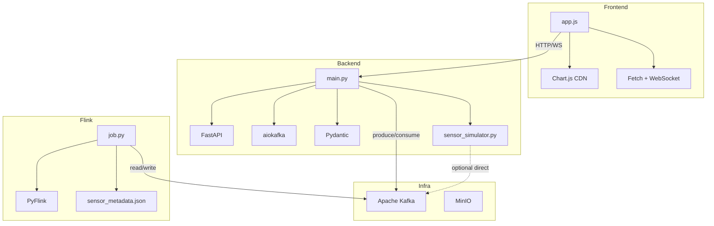

# Import-Abhängigkeiten

## sensor_simulator.py

### Standard Library
```python
import argparse
import json
import random
import sys
import time
from dataclasses import asdict, dataclass
from datetime import datetime, timezone
```

### Third-Party (optional, nur bei Kafka-Output)
```python
from kafka import KafkaProducer          # kafka-python
```

---

## backend/app/main.py

### Standard Library
```python
import asyncio
import json
import logging
import os
import sys
from collections import deque
from contextlib import asynccontextmanager
from dataclasses import asdict
from datetime import datetime, timezone
```

### Third-Party
```python
from fastapi import FastAPI, HTTPException, WebSocket, WebSocketDisconnect
from fastapi.middleware.cors import CORSMiddleware
from pydantic import BaseModel
from aiokafka import AIOKafkaConsumer, AIOKafkaProducer
```

### Projekt-Intern (zur Laufzeit)
```python
from sensor_simulator import SensorFleet  # importiert im run_simulator()
```

---

## flink-job/job.py

### Standard Library
```python
import json
import os
import logging
```

### Third-Party
```python
from pyflink.table import EnvironmentSettings, TableEnvironment
```

---

## frontend/public/app.js

### Externe Libraries (CDN)
```
Chart.js v4.4.7   → Chart-Objekt für Diagramme
Tailwind CSS      → Utility-CSS Framework (nur Styling, kein JS-Import)
```

### Browser-APIs (nativ)
```
fetch()           → REST API Aufrufe
WebSocket         → Echtzeit-Verbindung zum Backend
localStorage      → (nicht verwendet, aber verfügbar)
```

---

## Abhängigkeits-Graph



---

## Paket-Dateien

### backend/requirements.txt
```
fastapi==0.115.6
uvicorn[standard]==0.34.0
aiokafka==0.12.0
pydantic==2.10.4
```

### flink-job (im Docker)
```
apache-flink==1.18.1
```

### sensor_simulator.py (optional)
```
kafka-python      # nur für --output kafka
```
